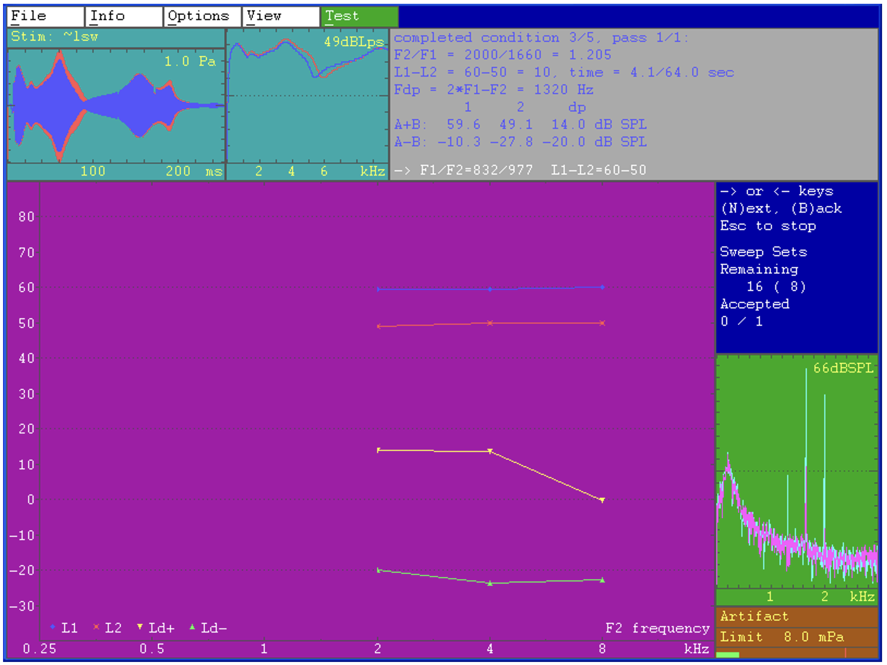
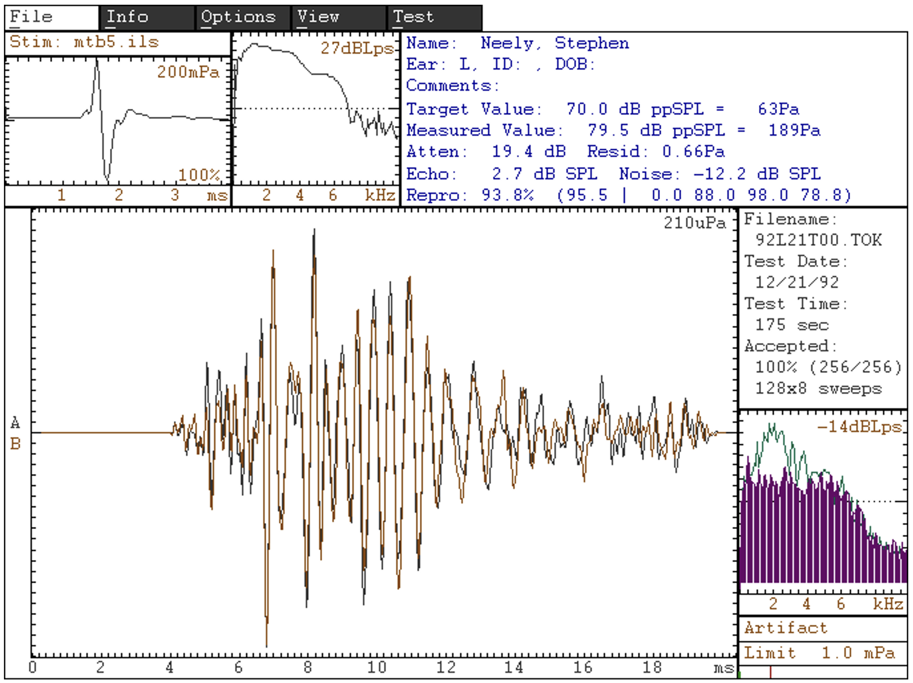
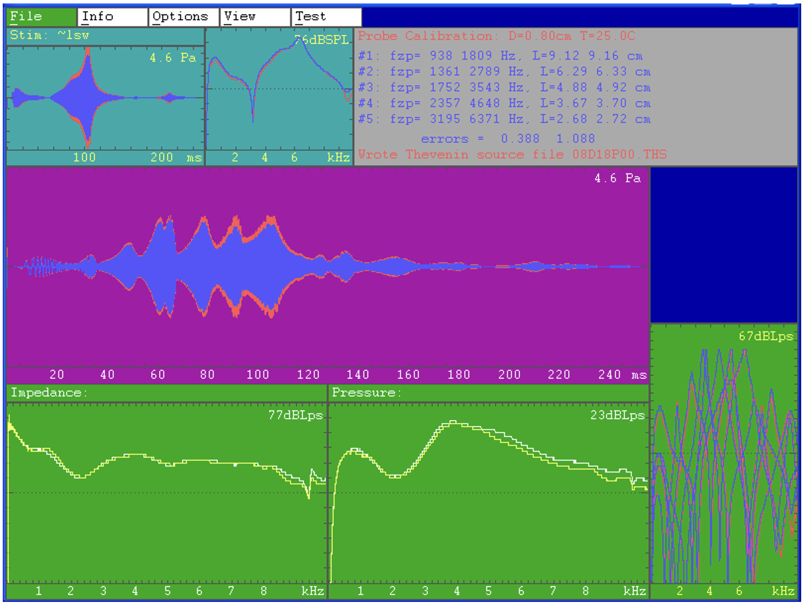
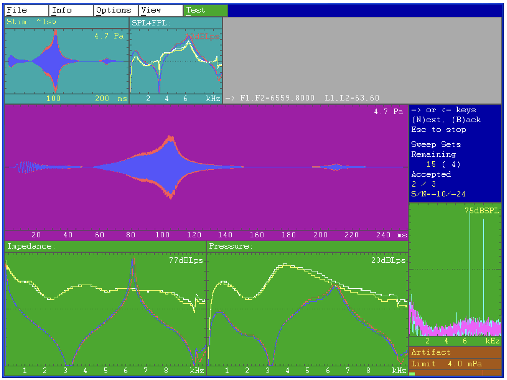

# EMAV User Guide

**Boys Town National Research Hospital**
*Stephen Neely*
August 2026

## Abstract

 EMAV is a program for measuring and displaying otoacoustic emissions. The distortion-product otoacoustic emission (DPOAE) test features artifact rejection, measurement-based stopping rules, and noise estimation at the same frequency as the distortion product. The transient-evoked otoacoustic emission (TEOAE) test features octave-band analysis and nonlinear-transducer-artifact correction. The PROBE test estimates Thévenin-equivalent impedance and pressure of the sound source. EMAV uses high-quality soundcards for stimulus generation and synchronous averaging for noise reduction. Currently supported soundcards include the BabyFace Pro (from RME Audio). An OAE probe microphone, such as the Etymotic ER-10C, is required for OAE measurement. Computer systems without special audio hardware can still view EMAV data files or print data displays to a printer. This document describes EMAV version 4.00. 

*(Note: This is an updated version of Technical Memorandum 17 originally dated January 1993)

---

## Table of Contents
1. [Introduction](#introduction)
2. [Tutorial](#tutorial)
3. [Tests](#tests)
   - [DPOAE](#dpoae)
   - [TEOAE](#teoae)
   - [PROBE](#probe)
   - [TONE](#tone)
4. [Menus](#menus)
   - [File Menu](#file-menu)
   - [Info Menu](#info-menu)
   - [Options Menu](#options-menu)
   - [View Mode](#view-mode)
   - [Test Menu](#test-menu)
5. [File Types](#file-types)
   - [Configuration File](#configuration-file)
   - [List File](#list-file)
   - [Stimulus Files](#stimulus-files)
   - [Data Files](#data-files)
6. [EMAV Parameters](#emav-parameters)

---

## Introduction
EMAV is a contraction of “emission averager.”  The user interface for the DPOAE  test in EMAV is similar in style to CUBeDIS, a DPOAE measurement program written by Jont Allen. The methods used by EMAV for TEOAE tests are similar to those developed for the ILO88 OAE averager from Otodynamics.  EMAV was designed to provide enough flexibility to allow experimenting with new ideas, while being friendly enough for routine use in a clinical setting. 

EMAV was originally designed to use an Ariel DSP-16+ board, a pair of ER-2 tube-phones with a 40 dB step-down transformer, and an Etymotic ER-10B with 40 dB of gain.  Recent versions of EMAV supports any Windows, Linux, or macOS soundcard that has the ability to synchronize input and output. The CardDeluxe (from Digital Audio Labs) is currently the most widely used soundcard at BTNRH for data collection. The Indigo IO 
(from Echo Digital Audio) and Lynx L22 (from Lynx Studio Technology) are also being used. Custom-made cables 
allow these soundcards to be used with the ER-10C 1. Under Windows, EMAV may use MME, WDM, or ASIO 
device drivers; however, synchronous averaging requires that the soundcard synchronize input and output 
consistently. A Linux version of EMAV is also available and uses ALSA device drivers. See the Appendices for 
additional information about soundcard installation and calibration. 

## Tutorial
A Windows installer is available for EMAV.  See Appendix A for software installation details. The most convenient way to use EMAV is to create a dedicated folder to contain all the protocol and data files associated with EMAV. To designate a working directory before using EMAV in Windows, right-click on the EMAV icon on the Desktop and choose the Properties/Shortcut tab.  In the “Start in” text field enter the pathway of the folder containing the necessary protocol (list) files that you will be using and the current configuration file.   

Prior to data collection, sound card parameters should be  measured and set in the configuration file. These parameters should be set for each unique hardware configuration so that the e ffects of different loads can be taken into account. Within EMAV the only directly accessible files are those found in the current working directory. All of the primary testing options in EMAV (DPOAE, TEOAE, Probe) have three phases: Check-fit, Calibration and Measurement. 

**Check-fit** 
During the check-fit phase, both time and frequency representations ar e displayed and continuously updated.  Each new waveform displayed on the screen is superimposed over previously displayed waveforms.  The screen is cleared automatically every few seconds or whenever you press Space.  You can judge the quality of the fit by viewing the recorded waveform and corresponding spectra that are displayed on the screen. If the fit is satisfactory, press Enter  or select Continue to proceed to the calibration phase. Otherwise, press Escape to cancel the test and 
return to the top-level menu selection. The check fit phase is similar in DPOAE, TEOAE and Probe tests. 
DPOAE Calibration and Measurement 
The calibration phase of the DPOAE test presents chirps to each  of the two receivers (loudspeakers) in sequence. 
The program uses the measured response to these chirps to calculate the voltage needed to produce any desired 
sound pressure level at the microphone. Press Y to accept the calibration and proceed to the measurement phase. 
Otherwise, you can press N to repeat the check-fit and calibration.  The calibration stimuli may be specified as 
waveform files or may be generated by EMAV. Th e calibration response waveforms are saved in MATLAB-
compatible (*.CAL) files.   
The first step in the measurement phase of the DPOAE test is to select the stimulus conditions to be presented to the 
ear. This may be done by creating list files that contain lists  of stimulus conditions (or protocols) ahead of time or 
these files can be created through EMAV by selecting File and then Create List File    If you have previously 
created list files and placed them in the working directory,  they will be displayed when you select the DPOAE test 

1 The maximum sound output of the ER-10C is limited to about 75 dB SPL unless the Preamp box is modified to 
bypass the “receiver equalization” that  is normally “in series” with the receivers (loudspeakers) and which 
attenuates the output level at low frequencies by about 20-dB. 

option.  If you create a new list file it will be saved in the working directory.  Select from the list by using the 
Up/Down cursor keys and pressing Enter at the desired protocol file.  Or, press Escape to remove the list of 
previously-saved protocols and create a new list of stimulus conditions. Once the measurement is underway, a 
countdown of the number of sweeps averaged is displayed. The measurement of a stimulus condition is terminated 
when any of the three specified stopping conditions (time, noise, signal-to-noise ratio) specified in the list file are 
met.  The measured levels of F1, F2, and Fd are displayed on the screen in the upper right box.  Ld+ represents the 
emission level at the 2*F1-F2 frequency and Ld- represents the noise level at the same frequency. The DPOAE 
measurements are stored in text (DAT) files in a format designed to be usable with the BTNRH PLT program. See Figure 1 for an example of the results of a typical DPOAE test.  

Figure 1.  DPOAE test display.  The calibration waveform using a frequency sweep stimulus is shown in the upper-left panel of the display and the spectrum of this waveform is shown in the adjacent panel.  The upper right panel contains information in 
blue regarding the most recently completed condition and the print in white at the bottom of the panel is information regarding  
the current condition.  The levels of the two stimulus tones measured at the plane of the probe and the distortion product are 
shown in the lower-left panel.  The frequency of F 2 is indicated on the abscissa and its level (50 dB SPL) indicated by the x 
symbol.  The frequency of F 1 was a fixed ratio of 1.2 below F 2 and its level (60 dB SPL) is indicated by the + symbol.  The level 
of the 2F1-F2 distortion product is indicated by the inverted yellow triangles and the noise level at this frequency is indicated by 
the upright green triangles..  The bottom-right panel is the response window.  It shows a spectral display of a running average of 
the stimuli and response components of ear canal pressure.  The A+B average is light blue and the A-B (noise) is in pink.  The 
middle left display contains information regarding the current stimulus condition.  Th e number in parenthesis represents the 
number of (one-quarter second) sweeps in each sub-average,  The upper-right panel contains information regarding the most 
recently completed condition (in blue) and information regarding the current condition (in white at the bottom of the panel). 

TEOAE Calibration and Measurement 
The calibration phase of the TEOAE test allows automatic adjustment of the signal amplitude for "in the ear" 
calibration.  Within the calibration phase, you can press A  to toggle the automatic signal amplitude adjustment on 
and off2.  The noise-level rejection threshold can also be adjusted during the calibration phase using the Left/Right 
cursor keys. When calibration is complete, press Enter to proceed to the measurement phase.  The calibration 
stimuli may be specified as waveform files or may be generated by EMAV. The calibration response waveforms are 
saved in MATLAB-compatible (CAL) files.   
During the TEOAE measurement, a countdown of number of sweeps is updated continuously.  The TEOAE 
waveform and spectrum display is updated as often as desired by pressing the space bar or will update automatically 
every 5 seconds.  You can also press Escape to terminate the test early or press F9 to suspend (pause) the test (e.g., 
in case you need to talk to someone in the middle of the test). The TEOAE responses are stored in a special binary 
(TOK) format.  See Figure 2 for an example of the results of a typical TEOAE measurement. 

Figure 2.  TEOAE test display.  The stimulus was a band limited click at a level of  79.5 dB ppSPL.  The stimulus waveform and 
spectrum are shown in the upper left and adjacent panels of the disp lay.  The response waveform ( echo) is shown in the large 
panel at the lower-left of the display.  The response spectrum (t o the right of the waveform) indicates a response peak of -20 dB 
Lps at about 2 kHz and a noise floor about 20 dB below the response.   The overall echo level is 2.7 dB SPL and overall noise 
level is -12 dB SPL. 

​                                                           
2 When the adjustment is turned on, you can also try pressing “R” to apply an “error correction” to the last part of 
the stimulus. This residual error correction (REC) is designed reduce the stimulus artifact due to transducer (i.e. 
receiver) nonlinearity. The REC is computed by inverse f iltering the residual in the stimulus interval of the 
waveform that remains after adding the four parts of the re sponse. The inverse-filtered re sidual is added to a stored 
correction signal that is added to the fourth part of the stimulus waveform. The REC process requires several 
iterations and is still somewhat e xperimental. Although REC helps to ma ke the ER-10C usable for TEOAE 
measurements, a better solution would be to use a more linear sound source. 

Probe Calibration and Measurement 
The probe option allows EMAV to calibrate stimuli using Forward Pressure Level (FPL) or Sound Intensity Level 
(SIL) instead of Sound Pressure Level (SPL).  Theoretically, SIL and FPL provide measures of stimulus level that 
better indicate what reaches the eardrum because they are not affected by standing waves.  SIL and FPL calibration 
both require that the acoustic load impedance of the ear  canal be measured, which requires that the Thévenin-
equivalent impedance and pressure of the sound source be determined from a set of known acoustic loads.   
The first step in FPL or SIL calibration is to estimate the source impedance and pressure.  A chirp stimulus is 
presented in SPL to each of 5 tubes of known length.  The le ngth of the tubes were select ed so that resonant peaks 
occur at 2, 3, 4, 6 and 8 kHz.  See Appendix E for additional details about this set of cavities. Thévenin source 
characteristics are obtained by repeatedly solving 5 linear equations in order to minimize the difference between 
measured and expected pressure responses.  An erro r value less than 1 for each loudspeaker indicates a good 
calibration.  See Figure 3 for an example of the results of a typical probe source calibration display. 

Figure 3. PROBE test calibration display.   The calibration pressure waveforms from the last measured cavity are 
shown in the upper-left panel.  As before, the red line is from the left loudspeaker and the blue line is from the right 
loudspeaker. The spectra of these waveforms are shown in the adjacent panel. The upper right panel reports the 
frequency of the first notch in the spectrum for each of the two sound sources, followed by the estimated tube 
lengths, which are calculated from the frequency of the first notch.  Results for each cavity are on a separate line.  
The error term associated with th e estimated Thévenin-equivalent source pressure and impedance is reported for 
each sound source.  An error value less than one indicate s a good calibration.  The .THS file named at the bottom 
of the panel contains the Thévenin-e quivalent source impedance and pressu re for the two sound sources. The 
middle panel shows (superimposed) the ca libration waveforms for each of th e 5 cavities.  The bottom-left panel 
shows the estimated source impedance magnitude for the two sound sources.  The bottom-middle panel shows the 
estimated source pressure for the two sound sources.  The bottom-right panel is the measured spectra of all the 
cavities in SPL superimposed. 

Load impedance, if required, is determined during the in-the-ear calibration phase of the DPOAE test with the probe 
assembly in the subject’s ear canal. Following the check-fit phase, load pressu re is measured. Ear canal pressure 
combined with previously-determine d Thévenin source characteristics provi des the necessary information to 

calculate load impedance.  Load impedance is required to  convert measured pressure in the ear canal to SIL and 
FPL. See Figure 4 for an example of an FPL/SIL calibration display. 

Figure 4 .  FPL/SIL calibration display.  This display is produced after in-the-ear (ITE) calibration during the 
DPOAE test when stimulus level is specified as SIL or  FPL. The conversion from SPL to SIL or FPL requires 
Thévenin-equivalent source values, whic h are stored in a .THS file after performing the calibration phase of the 
PROBE test.  The top left panel shows the pressure waveform as measured during ITE calibration. The red and blue 
lines represent the left and right loudspeakers.  The red and blue lines in the adjacent panel show the spectra of 
these pressure waveforms calibrated in SPL (per unit volt).  The yellow and white lines represent the same 
calibration spectra converted to FPL or SIL (per un it volt).  EMAV uses the FPL and SIL calibration spectra 
(yellow and white lines) to produce stimulus  levels for the DPOAE test that are calibrated to these units instead of 
SPL. The line of text above these spectra indicates whether EMAV will use SIL or FPL calibration. The middle 
panel contains the same pressure waveforms shown in the upper-left panel.   
The bottom-left panel shows the magnitude (in dB re 1 cgs acoustic ohm) of the estimated internal source 
impedance for the two sound sources (yellow and white) with the load impedance of the ear canal (red and blue) 
superimposed. The bottom-middle panel shows source pre ssure (yellow and white) for the sound sources and load 
(in the ear) pressure measured by the sound sources (red and blue). The bottom-right panel is the response window.  
It shows a spectral display of a running average of the s timuli and response components of ear canal pressure.  The 
A+B average is light blue and the A-B (noise) is in pink.  The middle left display contains information regarding the 
current stimulus condition.  The number in parenthesis represents the number of (one-quarter second) sweeps in 
each sub-average,  The upper-right pane l contains information regarding the most recently completed condition (in 
blue) and information regarding the current condition (in white at the bottom of the panel). 

## Tests
EMAV tests perform synchronous aver aging and require access to a sound card that has the capability to 
synchronize input and output consistently. EMAV can also retr ieve and display the results of previously saved OAE 

measurements using the File/Open function. This capability does not require a speci al soundcard; however, only 
files in the current working directory can be opened.  
When displaying the results of a previous measurement, the patient/subject information can be modified, if desired, 
and the modifications saved to the file using the File/S ave function.  A hard copy of the EMAV screen can be 
obtained at any time by pressing Ctrl-P or by using the File/Print function. When printing, the output can be directed 
to a PostScript file or printed directly to a PostScript (or HP PCL) printer. The printer name and print format are 
specified in the File/Printer Setup menu. 
There are many options that allow variations in the way th e OAE tests are performed.  For example, the abscissa of 
the DPOAE display may be changed to L1 or L2 level, to F1, F2  frequency, or to “Trial” to allow successive trials 
of any stimulus conditions to be displayed sequentially from left to right. EMAV menus are described in more detail 
in the Menus section below. 
An EMAV configuration file (emav.ini) allows setting defaults for most of the options that appear on menus and for 
other options not on the menus.  A complete description of the configuration file parameters appears in the 
Configuration File section. 
### DPOAE
The DPOAE test is used to measure distortion-product ot oacoustic emissions.  The probe (i.e., the sound source and 
microphone assembly) should be placed in the ear prior to st arting the DPOAE test.  When the test is started, the 
check-fit phase is immediately initiated.  During this phase, a calibration stimulus (either a chirp or white noise) is 
presented to the ear. The measured response to this stimulus is displayed both as a waveform and a spectrum.  The 
fit of the probe in the ear canal should be adjusted to obtain the flattest possible spectrum.  A proper fit sometimes 
requires checking to make sure the holes in the probe tip are unobstructed and that the probe is inserted as deeply as 
possible in the ear canal.
3  
When the fit of the probe is satisfactory, press Enter to proceed to the calibration phase of the test 4.  During this 
phase, the system response of each channel is measured and displayed on the screen.  The responses of the two 
channels should be similar to each other.  If you are satisfied that the calibration was successful, press Y or click on 
Yes to proceed to the measurement phase of the test.  Otherwise, you can press N  or click on No to repeat the 
check-fit and calibration. 
When the calibration waveform has been accepted, EMAV will either (1) begin i mmediately with the first stimulus 
condition, (2) present a list of file names for selection, or  (3) present a menu of parameters for generation of a new 
list file, depending on how the list parameter is set (via the configuration file or the Options menu).  The stimulus 
conditions for the DPOAE test are always obtained from a list file.  After the list file has been specified, the 
presentation of stimuli begins.  If you have only a single set of stimulus conditions that will be used for every 
DPOAE test, then the list file that specifies these conditions should be specified before starting the test.  If you have 
several sets of conditions, then the list specification should ma tch all of these files.  If you need to generate a new 
list file, you can do this prior to starting the DPOAE test using the “Create List File” option on the File menu or 
press Escape when presented with a list of filenames during the DPOAE test. 
Some aspects of the DPOAE test can still be modified af ter the presentation of stimuli has begun.  For example, 
pressing the left or right cursor will adjust the threshold for artifact rejection.  The artifact rejection threshold is 
displayed in the lower-right corn er of the screen.  Pressing F2 allows recalibration of the stimulus in the middle of 
the test. Pressing F9 will suspend the test temporarily.  Pressing Escape will terminate the test early without 
discarding any recorded measurements.  Pressing B will terminate the current stimul us condition and return to the 
previous stimulus condition. Pressing letter N will terminate the current stimulus  condition early and proceed to the 
next stimulus condition. 
At the end of the test you will be asked whether the recorded data should be saved in a file.  Press Y  or click on Yes 
to save this test and N  or No if not.  Even if you choose N, the test results can still be saved later, as long as these 
results are still displayed, by selecting the File/Save function. 
                                                          

3 When compressing the foam tip prior to insertion, pulling the foam away from the open end may improve acoustic 
measurements by creating a flatter surface at the plane of the probe.  
4 If a calibration has already been performed as part of a previous DPOAE test, then it is possible to skip the 
calibration phase and proceed directly to the test phase by pressing the letter T. 

### TEOAE
The TEOAE test is used to measure transient-evoked otoacoustic emissions in human ears.  The probe (i.e., the 
sound source and microphone assembly) should be placed in the ear prior to starting the TEOAE test.  When the test 
is started, the check-fit phase is immediately initiated.  Duri ng this phase, a transient stimulus is presented to the ear 
and the measured response is displayed both as a waveform and a spectrum.  The fit of the probe in the ear canal 
should be adjusted to obtain the flattest possible spectrum.  A proper fit sometimes requires checking to make sure 
the holes in the probe tip are unobstructed and that the probe is inserted as deeply as possible in the ear canal.   
When the fit of the probe is satisfactory, press Enter to proceed to the calibration pha se of the test.  During this 
phase, the program will automatically adjust the output level to achieve a specified “target” level.  Further 
correction of the stimulus waveform in order to reduce the nonlinear stimulus artifact can be initiated by pressing R.  
Both the level adjustment and artifact correction are optional.  Other aspects of the stimulus presentation (e.g. 
number of sweeps and artifact rejection threshold) can be modified during the calibration phase.  When the 
calibration adjustments have been completed, press Enter to proceed with the measurement phase of the test.  
After the measurement phase of the test has begun, it is s till possible to control some as pects of the test.  Pressing 
the left or right cursor will adjust the threshold for artifact rejection.  This is  displayed in the lower-right corner of 
the screen.  Pressing F9 will suspend the test temporarily.  Pressing Escape will terminate the test early without 
discarding any recorded measurements.   
At the end of the test you will be asked whether th e recorded data should be saved in a file.  Press Y  or click Yes  if 
you want to save this test and N or No if not.  Even if you choose N  you can still save the test later by using the 
File/Save function, as long as the recorded results are still displayed. 
### PROBE
The PROBE test is used calibrate the sound source for FPL or SIL measurements. Estimation of Thévenin-
equivalent source characteristics requires measurements in a set of cylindrical cavities. The default number of 
cavities is five. Prior to initiating th e Probe test, the probe (i.e., the s ound source and microphone assembly) should 
be placed in the cavity-set coupler. See Appendix E for inst ructions regarding constructi on of the set of cavities.  
EMAV repeats the check-fit and calibration phase for each of  the cavities. After the required number of calibration 
waveforms have been accepted, EMAV estimates source pressure and source impedance based on the cavity 
measurements, iterating if necessary.  The error associated with the estimation of source characteristics is displayed 
on the screen. An error value less than one indicates a good calibration. 
EMAV uses the acoustic impedance of the ear canal to pr oduce the SIL or FPL that ha s been specified in the 
stimulus protocol (or list) file.  EMAV reads the desired SIL or FPL in the list file, measures the SPL in the ear 
canal, and applies the FPL/SIL conversion to determine the required voltage to the loudspeaker to produce the 
desired stimulus level.  There are four steps involved in calibrating using FPL/SIL.   

1. The internal impedance and pressure of the sound source is determined.   
2. The impedance of the ear canal (load) is determined  from an SPL measurement of  the ear canal combined 
with the source impedance and pressure.  
3. The load impedance is used convert SPL to FPL or SIL.   
4. The FPL or SIL calibration is used to determine the voltage presented to the loudspeakers during DPOAE 
measurement. 
These steps are described in greater detail below. 
Step 1.  Determine source impedance and pressure.  The source impedance and source pressure are estimated 
from pressure measurements in a set of cylindrical cav ities with known impedance. In  practice, the theoretical 
impedance of a cylindrical cavity is so sensitive to the length of the cavity that cavity lengths are initially assumed 
to be only approximate and these lengths are iterated to improve agreement with the m easurements. The theoretical 
impedance of a cavity may be calculated when the length, diameter and temperature of the cavity are known.  The 
initial cavity lengths are calculated from the frequency of first spectral notch. The cavity length is assumed to be 
one-fourth of the wavelength of the notch frequency. L=(c/f)/4, where c is the speed of sound. The theoretical cavity 
impedances and measured pressures allow a least-squares estimate of source impedance and pressure. The error in 
this estimate indicates how much the theoretical description of the sound source and cavity impedance deviates from 
the combined set of measured pressures. By repeating the procedure using small changes in cavity lengths, the error 
term can be minimized.  The optimum source impedance and pressure are associated with the smallest error. The 

cavity chirp-response pressure waveforms are stored in a .PRB file. The source impedance and pressure are stored 
in a .THS file. 
Step 2.  Determine load impedance (or ear-canal acoustic impedance).  Load impedance is calculated from (1) 
load pressure (ITE calibration), (2) source impedance, and (3) source pressure.  Source impedance and source 
pressure are found in the .THS file created at the conclusion of Step 1. The ear-canal chirp-response pressure 
waveforms (for each sound source) are stored in a .CAL file. The load impedance is stored in a .THL file. 
Step 3.  Load impedance is used to convert load pressure (SPL) to SIL or FPL.  The SIL conversion is based on 
the real part of the load admittance, which is called conductance. The FPL conversion is proportional to sum of the 
load impedance and its characteristic (or surge) impedance. 
Step 4.  EMAV uses the load impedance to det ermine the desired SIL or FPL in the ear-canal.  EMAV reads 
each stimulus level in the list file and adjusts the voltage to the speaker to produce the desired level in SPL, SIL, or 
FPL. The stimulus-level unit is specified in the header of the list file.   
The files produced by the SIL/FPL calib ration procedure are listed below. Unique files names (*) are generated for 
.PRB, .THS, and .THL file. The .txt files are temporar y, are overwritten each time th ey are produced, and may be 
deleted whenever desired. 

File name When Contents 
*.PRB  PROBE test Waveforms in dB SPL for all cavities and both channels. 
*.THS PROBE test Thévenin-equivalent source im pedance and pressure for both channels in 
4 Hz steps. 
Zcav0.txt PROBE test Final length estimate and internal impedance and phase for each cavity for 
each sound source. 
Zcav1.txt PROBE test Alternate impedance for programmer only. 
Zcav2.txt PROBE test Alternate impedance for programmer only. 
THS1.txt PROBE test .THS file in .txt format-used for plotting-channel 1. 
THS2.txt PROBE test .THS file in .txt format-used for plotting-channel 2. 
*.THL  DPOAE test when 
level unit=FPL or SIL 
Created from .CAL and .THS files and used to convert SPL to FPL or 
SIL.  This file can be recreated from the .CAL and .THS files at any time. 
Reflectance:  When the PROBE option is used to calculate FPL  or SIL, middle-ear reflectance is calculated and 
reflectance values, in dB, are reported in the .DAT file for F1, F2, and F3.   
### TONE
The TONE test is used more for testing the hardware than for testing ears.  Presentation of the tone stimulus is 
initiated by selecting Start Tone. The level and duration of the tone can be specified. Tones can be output on either 
one of the two channels (A or B) of the soundcard.  You can tell EMAV whether or not to remove the “DC” 
component from the response waveform. You can select whether the tone is presented once or repeated. The 
recorded response to the tone is displayed along with its calculated P-P and RMS level.  
## Menus
There are five major-function items listed on the menu bar at the top of the EMAV screen: File, Info, Options, 
View, and Test. “View” puts EMAV in a special mode for examining the results  of an OAE measurement in more 
detail. The other four major functions produce submenus of additional items.  
Most of the EMAV functions are menu-driven. Choose the desired item on the menu bar at the top of the screen by 
either pressing the designated “short-cut” key or clicking on the menu item with the mouse cursor. The short-cut 
key is indicated on each menu item as an underlined letter. For example, press I to enter patient/subject information. 
Alternative short-cut keys, if any, appear in parentheses at the right-hand side of a menu item. Within submenus, an 
ellipsis “...” at the end indicates that another submenu will be displayed, a colon “:” indicates that a text field will be 
opened for editing, and an equals sign “=” indicates that a multiple-choice item will be “toggled” to the next value. 

Items within a menu may be selected by using the Up/Down cursor keys and pressing Enter. Multiple-choice items 
are altered by pressing Enter to “toggle” their value. Text fields are altered by pressing Enter to open the menu item 
for editing. When editing of a text field is complete, you must press Enter again to close and accept the edited text 
field. Use Escape to close and discard any changes to the text. Use Escape also to remove any subset of menu items 
from the display. To initiate an EMAV test, press T to open the “Test” menu, then press D, for example, to start the 
DPOAE test or press T to begin the TEOAE test. These two OAE tests both consist of three phases:  (1) check-fit, 
(2) in-the-ear calibration, and (3) OAE measurement.  If you want to measure DPOAEs in FPL (Forward pressure 
level) or SIL (sound intensity level) rather than SPL, you must determine the Thévenin characteristics of the probe 
first using the PROBE option. 
### File Menu
The File menu lists items that perform functions related to data files, screen printing, and program control. 
Open...  Allows existing data files to be opened for review and limited editing, for example of patient/subject 
information.  A submenu is presented with three items. 
Open File  - causes the file specified in the File Name field to be opened, or if the file name 
contains a wild-card character5 it presents a list of matching files for selection.  
File Type = toggles between DPOAE, DPSWP, DPCAL, PROBE, and TEOAE.  Each file type 
has a different default filename that matches any file name with the appropriate extension (.DAT, 
.SWP, .CAL, .PRB, or .TOK). 
File Name : specifies the file to be opened or pattern (with one or more wild card characters) of 
file names to be listed for selection. 
New -  Erases contents of screen, resets all program variables to their initial state, and re-reads the configuration file 
(emav.ini) containing default parameter values. 
Print Screen -  Causes the contents of the screen to be printed as specified in the Printer Setup menu.  This 
command can also be invoked by pressing Ctrl-P (or Ctrl-W). 
Printer Setup...  Specifies the manner in which the screen is printed.  A submenu is presented with three items. 
Printer Port : specifies the port (e.g. LPT1) of a directly  connected printer, a file to which the 
printer output will be directed, or the network name of a printer on the local area network (e.g., 
\\cellinux\lp). 
Printer Type = the printer type will toggle between Post Script, Color PostSc ript, and PCL. The 
Color PostScript option is proba bly the best choice when printi ng to a file, because it can be 
inserted into Word documents. The PCL printer type is usable with many Hewlett-Packard 
(DeskJet and LaserJet) printers.  
Orientation = the printer orientation will toggle between Portrait and Landscape. The Portrait 
option produces a smaller screen image at the top of the page. The Landscape option produces a 
larger, rotated screen image. 
File Save -  Allows an open file to be written again to the same file name to save any changes made to the 
patient/subject information.  When no file is currently open, the File Save function is disabled. 
Create List File - Provides a menu of stimulus parameters to assist with the creation of new stimulus protocol (i.e., 
list) files for the DPOAE test.  
Create Load File - Allows creation of a new Thévenin “load” file (THL) from two existing files: a “calibration” 
file (CAL) and a “probe” file (PRB).  
Extract SFOAE -  Interprets a previously opened DPOAE data file (DAT) as containing responses to pairs of 
stimulus conditions: with a suppressor and without a suppr essor. A new DAT file is produced that contains the 
response with suppressor subtracted from the response without suppressor.  
                                                          

5 An asterisk “*” matches any number of any characters in a f ilename, while a question mark “?” matches only a 
single instance of any character. 

About EMAV - Displays information about the program version and authors of the EMAV program. The currently 
selected soundcard is also displayed. This function may also be invoked by pressing the F1 function key.  
Exit - Terminates the EMAV program.  This function can also be invoked by pressing Ctrl-C. 
### Info Menu
The Info menu allows the user to enter the patient/subject information that will be stored in the data file.  The 
patient/subject information in existing data files may be modified by opening the file, editing the information, and 
then saving the file using the File/Save function.  There are seven items on the Info menu: Last Name, First Name, 
Ear (Left or Right), ID (identification number), Date of Birth, Threshold and Comment.   
### Options Menu
The Options menu contains parameters that affect progr am operation and test measurement to be viewed and 
modified.   Any changes made in the Options menu will not
 be retained once EMAV is closed.  When EMAV is 
reopened the parameters will have returned to the default settings specified in the EMAV configuration file 
(emav.ini).  Default settings can be modified in the configuration file itself.  There are five items on the Options 
menu: System, DPOAE, TEOAE, PROBE, and TONE. 
System.…   Parameters that affect all EMAV measurements. 
Display Units (mV or mPa) = specifies whether information is displayed during the tests in units 
of sound pressure (mPa) or voltage (mV). 
I/O Sensitivity…  - Displays seven input/output sensitivity parameters: 
AD_sensitivity (cnt/V) : the sensitivity of the A/D converter in count per volt. 
DA1_sensitivity (cnt/V) : the sensitivity of the first (or Le ft) D/A converter in count per 
volt. 
DA2_sensitivity (cnt/V) : the sensitivity of the second (or Right) D/A converter in count 
per volt. 
MP_transfer : The name of a file that specifies a frequency-dependent microphone 
sensitivity. The MP_transfer file may be a text file with one frequency and sensitivity 
(V/Pa) pair on each line. In th is case, the MP_sensitivity para meter is still used to scale 
waveforms, but not frequency components leve ls. Alternatively, the MP_transfer file 
may be a MATLAB-compatible SYSRES data f ile. In this case, the transfer function 
contained in the MAT file is multiplied by the MP_sensitivity parameter. 
MP_sensitivity (V/Pa) : sensitivity of the microphone in volts per pascal, when it is 
assumed to be constant for all frequencies. Th e value of this parameter for the ER-10C is 
0.05, 0.5, or 5 depending on whether the GAIN switch is set to 0, +20, or +40 dB. 
LS1_sensitivity (Pa/V): sensitivity of the first (Left) r eceiver (loudspeaker) in volts per 
pascal. 
LS2_sensitivity (Pa/V): sensitivity of the second (Right) receiver (loudspeaker) in volts 
per pascal. 
DPOAE…   Parameters that affect the DPOAE test. 
Buffer Size : the number of samples in the DPOAE stimulus. The default value is set by the 
parameter “size” in the configuration file. 
Rate of Clock (Hz) : the A/D and D/A sampling rates (samples/second).  
Sweeps per Set : This parameter specifies the number of sweeps in each set for the measurement 
phase of the DPOAE test. For efficiency, the to tal number of sweeps averaged for each test is 
divided into sets with a few sweeps in each set.   
DP Frequency = the distortion-product frequency to be measured.  The value toggles among 
2*F1-F2, 3*F1-2*F2, 4*F1-3*F2, 2*F2-F1, and F2-F1.   

Input Mode = controls the reading and writing of sweep (SWP) files.  The value toggles among 
REAL TIME, RECORD, and PLAYBACK.  REAL TIME is the normal A/D Input Mode with no 
sweep file involvement. RECORD mode reads input from the A/D and saves each subset of 
recorded sweeps to a sweep file. PLAYBACK read s input from a sweep file instead of from the 
A/D. A sweep file must be opened (using the File/Open function) to allow PLAYBACK mode.  
Stimuli…  parameters related to the DPOAE stimulus 
Checkfit stimulus : the name of the stimulus file to be used during the check-fit phase of 
the DPOAE test. Special names indicate stimuli generated by EMAV: “~lsw” produces a 
chirp stimulus and “~bbn” produces a white-noise stimulus. 
Calibration stimulus : The name of the stimulus file to be used during the calibrate 
phase of the DPOAE test.  Special names indicate stimuli generated by EMAV: “~lsw” 
produces a chirp stimulus and “~bbn” produces a white-noise stimulus. 
Calibration attenuation : The (internal) attenuation (dB) applied to the stimulus during 
the calibrate phase of the DPOAE test. The level of the calibration stimulus will be this 
number of decibels below the maximum possible output. 
Suppressor : an additional stimulus that is added to the second (Right) channel. Possible 
values are: None for no suppressor, Tone for a tonal suppressor consisting of one or two 
tones, BPN for band-pass noise, and XBPN  for band pass noise that excludes DP 
frequencies. Use F3, F4, L3, and L4 in the list file to specify the frequency and level of 
the two tones or the edges of the band-pass noise.  
Adjust F1 : an option to allow the user to vary the level and phase of the first primary 
tone during the DPOAE test. Possible values are Yes and No.  
Ramp Time (ms) : The duration (in ms) of a linear ramp applied to the beginning and 
end of all tones used in the DPOAE test. B ecause the ramp must be applied prior to 
response averaging, this feature is not enabled unless the number of skipped sweeps 
(skips) is greater than zero. 
CheckFit Time (s) : When this parameter is non-zero, the check-fit portion of a test will 
time-out after the specified number of seconds  and the subsequent in-the-ear calibration 
will be accepted. This feature is useful when  performing self-tests when the probe and 
computer are not in the same place. 
Protocol File : The name of the parameter list file that specifies the stimulus conditions 
to be presented during the measurement phase of the DPOAE test.  If the file name 
contains a wild card character (such as “*”), then a list of all matching file names will be 
presented for selection during the DPOAE test. 
Level Unit : Tells how EMAV should interpret the levels specifies in list files. The 
choices are SPL (sound pressure level in dB re 20 micropascal), SL (sensation level dB 
re threshold), V (volts), FPL (forward pressu re level in dB re 20 micropascal), and SIL 
(sound intensity level in dB re 1 picowatt/meter
2). 
Display…  parameters related to the DPOAE measurement display 
Maximum Ordinate Level (dB) : The maximum level (in dB SPL) on the y-axis of the 
measurement display.  
Minimum Ordinate Level (dB) : The minimum level (in dB SPL) on the y-axis of the 
measurement display.  
Maximum Abscissa Level (dB) : The maximum level (in dB SPL) on the x-axis of the 
measurement display when the abscissa represents levels.  
Minimum Abscissa Level (dB) : The minimum level (in dB SPL) on the x-axis of the 
measurement display when the abscissa represents levels.. 
Maximum Frequency (oct) : The maximum frequency on the x-axis of the 
measurement display when th e abscissa represents frequencies. The frequency is 
expressed as the number of octaves relative to 1 kHz. 

Minimum Frequency (oct) : The minimum frequency on the x-axis of the measurement 
display when the abscissa represents freque ncies. The frequency is expressed as the 
number of octaves relative to 1 kHz. 
Spectrum…  parameters related to the DPOAE spectral display (Response Window) 
Spec. Freq. Range Type : the range of the frequencies can be set to FIXED or AUTO. 
When the range is set to AUTO the maximum frequency on the x-axis of the spectrum 
varies with the F2 frequency.  
Spec. Frequency Range (kHz) : the maximum frequency (kHz) on the x-axis of the 
spectrum when it is FIXED.  
Spec. Level Range (dB) : the range of levels (dB) along the y-axis of the spectrum. The 
range is relative to the highest stimulus level.  If this range is too small, the baseline of 
the spectrum will not be visible.   
Data File…  parameters related to the DPOAE data file 
Data Format Type : The choices are Normal (one distortion frequency only), High 
Order (2*F1-F2, 3*F1-2*F2, 4*F1-3*F2, 5*F 1-4*F2), Extended (2*F1-F2, 3*F1-2*F2, 
4*F1-3*F2, 2*F2-F1), Multi (Extended plus 2*F1-F3, 2*F3-F1, 2*F1-F4, 2*F4-F1), or 
SFOAE (F2-FM, F2+FM, F1-FM, F1+FM). Only th e first character (N, H, E, M, or S) is 
checked by the program. 
Save Response Binary : Specifies whether the response waveforms should be written to 
a binary data file (Y or N). 
DP Octave : Number of octaves of the primary frequencies (F1 & F2) that are included 
in the stimulus. The value can be 0, 1, or 2. This feature is disabled when suppressor 
tones are included in the stimulus. 
High-Pass Filter… parameters related to the DPOAE high-pass filter. This filter is applied only 
to the noise measurement used for artifact rejection.  
HPF Frequency (Hz) : cutoff frequency (Hz) of the high-pass filter applied to the 
difference waveform used to determine artifact rejection when HPF_type=0 (fixed) 
HPF Type = Selects the type of high-pass filter applied to the difference waveform used 
to determine artifact rejection. The choices are 0=fixed, 1=auto, and 2=off. The “fixed” 
setting tells EMAV to always use the cuto ff frequency specified by HPF_freq. The 
“auto” setting tells EMAV to set the cutoff frequency one octave below F2. The “off” 
setting tells EMAV not to apply a high-pass filter. 
Noise… parameters related to the noise level estimate during the measurement phase.  
NNSB : The “number of noise side-bands”. This parameter specifies the number of 
adjacent-frequency components on each side of the DP frequency that will be included in 
the noise level estimate during the measurement phase of the DPOAE test. When the 
value is positive, the two partial averages (A & B) are added and the noise level is 
estimated from the combined sp ectrum (A+B). When the valu e is zero or negative, the 
noise level is estimated from the difference spectrum (A-B). When the value is 0, the 
default value, the noise level estimate is based on only the (A-B) spectral component at 
the DP frequency. 
NFSB : number of noise sidebands included in the detection of noise-floor separation. 
NF_separation (dB)  : threshold (in dB) for rejecting sub-averages due to noise floor 
separation. 
Reduction Mode = selects an experimental method for noise reduction. Its value toggles 
among DP+ (no noise reduction), DPnr1 (method 1, removes mean value), and DPnr2 
(method 2, removes trend). 
Reduction Threshold (dB) : apply noise reduction only when the noise estimate changes 
by more than this threshold. 

TEOAE…   parameters that affect the TEOAE test. 
Buffer Size : Number of samples in the TEOAE stimulus .  The number of samples in each sweep 
may be up to four times this number, depending on the stimulus presentation mode. 
Rate of Clock (Hz) : the A/D and D/A sample rates (samples/second).  
Sweeps per Set : number of sweeps in each set for the m easurement phase of the TEOAE test. 
This parameter is called “sweeps” in the configuration file. For efficiency, the total number of 
sweeps averaged for each test is divided into sets with a few sweeps in each set.   
Number of Sweep Sets : maximum number of sweep sets to be measured.  
Stimulus presentation mode = stimulus sequence presented for each sweep. Possible values are 
{+1}, {+1 -1}, 2={+1 +1 -2}, 3={+1 +1 +1 -3}, 4={L R B}, and 5={L R L R B*2}. Numeric 
patterns are generated only on the first (or left) D/ A channel and the number refers to the relative 
amplitude of each section of the waveform. Th e last two patterns alternate between the two 
channels (L &R) until the final section which is applied to both channels (B). 
Stimulus File : the name of the stimulus file used for the measurement phase of the TEOAE test. 
The default name “~ssw” tells EMAV to generate a short-sweep stimulus.  
Checkfit Stimulus : the name of the stimulus file used during the check-fit phase of the TEOAE 
test.  When the name is “~ssw”, EMAV generates a short-sweep stimulus.   
Artifact Rejection and Response Filter…  parameters related to artifact rejection and response 
filter. 
Hi Pass Filter Frequency (Hz) : The cutoff frequency (Hz) of a high-pass, 12-
dB/octave filter applied to the response waveform to improve the signal to noise ratio. 
The signal pass-band is between F1 and F2. 
Lo Pass Filter Frequency (Hz) : The cutoff frequency (Hz) of a low-pass, 12-dB/octave 
filter applied to response waveform to improve signal to noise ratio. The signal pass-band 
is between F1 and F2. 
Rejection Threshold (mPa) :. Initial threshold (in millipascal) for artifact rejection 
during the measurement phase of the TEOAE test.  The threshold value may be modified 
during the measurement phase by using the left or right cursor keys 
Start Time (ms) : The beginning of the response (or echo) interval of the recorded 
waveform specified in milliseconds from the onset of the stimulus.  The recorded 
waveform is ramped on 1 msec prior to Time1 and is set to zero prior to this 1 msec 
ramp. 
End Time (ms) : The end of the response (or echo) interval of the recorded waveform 
specified in milliseconds from the onset of th e stimulus.  The recorded waveform is 
ramped off at Time2 and is set to zero after this 1 msec ramp. 
Ramp Time (ms) : duration of a linear ramp at the beginning and end of the window 
used to select the TEOAE from the measured waveform.  
Spectrum Frequency Range : Horizontal full-scale range (i n kHz) of the TEOAE spectrum 
display..  
Spectrum Level Range : Vertical full-scale range (in dB) of the TEOAE spectrum display. 
PROBE...  parameters that affect the PROBE test. For consistency, the first two items share internal variables with 
the DPOAE test. 
Buffer Size : the number of samples in the DPOAE stimulus.  
Rate of Clock (Hz) : the A/D and D/A sampling rates (samples/second).  
Spectrum Frequency Range : Horizontal full-scale range (i n kHz) of the DPOAE spectrum 
display. 
Spectrum Level Range : Vertical full-scale range (in dB) of the DPOAE spectrum display. 

Calibration…  parameters that describe the calibration pr ocedure. For consistency, the first four 
items share internal variables with the DPOAE test. 
Sweeps per Set : number of sweeps in each set for the measurement phase of the 
DPOAE test.  
Number of Sweep Sets : maximum number of sweep sets to be measured.  
Stimulus File: The name of the stimulus file to be used during the calibrate phase of the 
DPOAE test. Special names indicate stimuli generated by EMAV: “~lsw” produces a 
chirp stimulus and “~bbn” produces a white-noise stimulus.  
Attenuation : Number of db that the calibration stimulus is attenuated relative to 
maximum output.  
Number of cavities to test : Number of test cavities used during the probe calibration 
phase.  
Number of sources to test : Number of sound sources. Setting nsrc=1 changes the 
PROBE test to allow load calibration in addition to source calibration.  
Thévenin Computation…  parameters affecting computation of Thévenin source characteristics. 
Compute Crosstalk = Yes or No. Modifies the equations solved for source 
characteristics to include an additional variable representing crosstalk. 
Iterate Length = Tells EMAV whether to perform iterative improvement of its initial 
estimates of cavity lengths. The default value is “Y: for “yes”. Alternate values are “N” 
for “no” and “M” for “maybe,” which prompts the user for a yes or no decision after the 
initial cavity length estimates are displayed. 
Iterate T & D = Yes or No. Tells EMAV whether to  include cavity diameter and 
temperature when iterating. The default value is N for no. The alternate value is Y for 
yes.   
Smooth = Setting “smooth” to a number greater than zero tells EMAV to smooth its 
estimates of Thévenin source characteristics across that number of adjacent frequencies.  
f1_erf :  Specifies the lower frequency limit of  the range of frequencies over which 
EMAV calculates an error value based on devi ation of estimated source characteristics 
from ideal values.  
f2_erf :  Specifies the upper frequency limit of the range of frequencies over which 
EMAV calculates an error value based on devi ation of estimated source characteristics 
from ideal values. 
Temperature : Calibration cavity temperature (°C) used in the calculation of ideal cavity 
impedance.  Default value is 25
o (Room Temperature).  If cavities are measured at body 
temperature,  37o should be used. 
Diameter : Internal cavity diameter (in centimeter s) used in the calculation of ideal 
cavity impedance.  
Min. Res. : If the estimated load impedance has a r eal part less than this value (cgs 
acoustic ohms), then it will be set equal to this value. 
Z_cav = 0 or 1. Selects between different methods of calculating the theoretical-ideal 
cavity impedance. The default value is 0.  
Length Decrease = Yes or No. For initial estimates of cavity length, these lengths may 
be assumed to be in decreasing order.  
TONE...  parameters that affect the TONE test. 
Buffer Size : the number of samples in the stimulus buffer.  
Rate of Clock (Hz) : the A/D and D/A sample rates (samples/second).  

Ramp Time (ms) : the duration (in msec) of a linear ramp applied to all tones. No ramp is applied 
unless the number of skipped sweeps is greater than zero.  
Skipped Sweeps : number of sweeps skipped before response averaging begins. Skipping sweeps 
avoids transient responses due to stimulus onset.  
Spectrum Frequency Range (kHz) : maximum frequency on the x-axis of the spectrum. 
Spectrum Level Range (dB) : range of levels along the y-axis of the spectrum. 
### View Mode
When results of an OAE test are displayed, pressing V (for View) puts EMAV into a special View mode that allows 
the test results to be examined in more detail.  
When DPOAE results are displayed in View mode, a small, vertical-line cursor appears on the results of a selected 
stimulus condition. Pressing +, Tab, or right clicking the mouse advances the cursor to the next stimulus condition, 
while –, Shift-Tab or left clicking the mouse backs up to the previous stimulus condition. The stimulus and 
response information in the upper-right pa nel changes according to the selected condition. If binary data has been 
saved for the DPOAE results, then the signal and noise sp ectra that correspond to the selected condition will be 
displayed.   If the binary data has not been saved in the Start In directory, the Response Window will be blank. 
When TEOAE results are displayed, pressing F6 separates the two waveforms. Pressing + expands the waveform 
and – contracts the waveform along the time axis. When the waveform is expanded, pressing Tab advances the 
display along the time axis and Shift-Tab shifts the display in the reverse direction. 
For either type of data, pressing F7 exchanges the position of the measurement results panel and spectral display 
panel, to allow for closer inspection of the spectra. Pressing Escape exits from View mode. 
### Test Menu
There are four tests (DPOAE, TEOAE, PROBE, and TONE) on the test menu. Pressing the designated letter ( D, T, 
P or E) causes the test to begin. 
## File Types
### Configuration File
The configuration (initialization) file is called “emav.ini” by default and can be located either in (1) the current 
directory, (2) the directory containing the program (emav.exe), or (3) any directory listed in the PATH environment 
variable.  The configuration file is divided into six sections SYSTEM, PRINTER , TEOAE, DPOAE, PROBE, and 
TONE.  Each section begins with a line containing the name  of the section enclosed in brackets.  The parameters 
that can be given values are describe d below for each section.  The default value for each parameter is indicated.  
Lines that begin with a semicolon in the configuration file are ignored and can be used for comments or to 
temporarily disable a parameter setting.  The letters in the parameter name are not case-sensitive.  Many of the 
parameters may also be set through the Options menu in  EMAV.  Changing a parameter value within EMAV will 
not change the default value specified in the configuration file.   
Refer to the Parameters table for a listing of parameters that can be included in a configuration file.  A majority of  
these parameters can also be defined through the Options menu within EMAV.  The descriptions of these 
parameters are located in the Menus section of this manual.  All remaining configuration file parameters not defined 
elsewhere are included below. 
SYSTEM Parameters 
The SYSTEM section begins with a line containing the word SYSTEM in brackets like this: [SYSTEM].  
Parameters in this section apply to all tests.  Thes e parameters should be set for your soundcard using the 
instructions given in Appendix C.  They are specific to the sound card and the load characteristics of your hardware, 
therefore separate configuration files may need to be required for different equipment configurations. The following 
list of SYSTEM parameters includes default values.  

AD_type = 0 
This parameter is obsolete. Previously, if this parameter were set to 1, the program would skip clock 
synchronization checks for the Ariel DSP-16+.  
DSP = W 
Type of soundcard: W=Windows. 
DSP_code =  
Name of the file containing DSP code that needs to be uploaded to the soundcard. 
GREG = 16 
This parameter is obsolete. Previously, this parameter m odified the allocation of data memory. The current version 
always allocates 16K words of for data, which allows DPOAE size up to 2048, and TEOAE size up to 1024. 
refresh = 5 
Number of seconds between automatic screen refreshes.  If refresh is set to zero, automatic refresh is disabled. 
AD_sensitivity = 0 
Sensitivity of the A/D converter in count per volt. Wh en set to zero, the value is calculated from ARSC 
registry volts-full-scale value. 
DA1_sensitivity = 0 
Sensitivity of the first (or Left) D/A converter in count per volt. When se t to zero, the value is calculated 
from ARSC registry volts-full-scale value. 

DA2_sensitivity = 0 
Sensitivity of the second (or Right) D/A converter in count per volt. When set to zero, the value is 
calculated from ARSC registry volts-full-scale value. 
MP_transfer = 
Name of a file that specifies a frequency-dependent  microphone sensitivity. The MP_transfer file may be a 
text file with one frequency and sensitivity (V/Pa) pair on each line. In this  case, the MP_sensitivity 
parameter is still used to scale waveforms, but not frequency components levels. Alternatively, the 
MP_transfer file may be a MATLAB-compatible SYSRES  data file. In this case, the transfer function 
contained in the MAT file is multiplied by the MP_sensitivity parameter. 
MP_sensitivity=0.05 
Sensitivity of the microphone in volts per pascal, when it is assumed to be constant for all frequencies. The 
value of this parameter for the ER-10C is 0.05, 0.5, or 5 depending on whether the GAIN switch is set to 0, 
+20, or +40 dB. 
LS1_sensitivity = 5 
Sensitivity of the first (Left) receiver (loudspeaker) in volts per pascal. 
LS2_sensitivity = 5 
Sensitivity of the second (Right) receiver (loudspeaker) in volts per pascal. 

PRINTER Parameters 
The PRINTER section begins with a line containing the word PRINTER in brackets like this: [PRINTER].  
Parameters in this section relate to printing the contents of the screen. The following list of PRINTER parameters 
includes default values. 
Label = Boys Town National Research Hospital 
This causes the menu bar to be replaced by the specified label during printing. Replacement can be eliminated by an 
empty parameter setting “Label=”. 
Orient = Landscape 
Printing can be formatted in one of two possible orientations: Landscape or Portrait. 
Port = screen.ps 
The printer port, for a directly connected printer, may be specified by name, such as LPT1.  Network printers may 
be specified by their network name (e.g., \\cellinux\lp). Instead of a port name or network printer name, this 
parameter may be set to a file name and screen images will be written to the specified file. 
Type = PostScript 
You can choose one of three printer types:  PostScript, Color PostScript, or PCL.  The PostScript output is suitable 
for including in other documents as an Encapsulated PostScript file.  The PCL output can be used with HP LaserJet 
or HP DeskJet printers.  
TEOAE Parameters 
The TEOAE section begins with a line containing the word TEOAE in brackets like this: [TEOAE].  Parameters in 
this section relate to the TEOAE test. The following list of TEOAE parameters includes default values. 
adjust = M 
The type of the attenuator adjustment used during the calibration phase of the TEOAE test: A=auto or M=manual. 
chk_atten  = 10 
Attenuation applied to the stimulus during the check-fit phase of the TEOAE test. 
chk_swps  = 25 
Number of sweeps to be averaged before updating the display during the check-fit phase of the TEOAE test. 
HPF1 = 0 
The cutoff frequency (Hz) of a 12-dB/octave, high-pass filter on A/D channel 1 for the purpose of blocking very-
low-frequency noise. The default value is zero, which disables this feature. 
HPF2 = 0 
The cutoff frequency (Hz) of a 12-dB/octave, high-pass filter on A/D channel 2 for the purpose of blocking very-
low-frequency noise. The default value is zero, which disables this feature. 
FFTref = 0 
Reference level used for the TEOAE spectrum display.  A va lue of 0 specifies a “level per cycle” reference, which 
is the equivalent SPL level in a 1 Hz bandwidth.  A value of 1 species an SPL level re 20 micropascal rms. 
target = 70 
The initial target for the calibration phase of the TEOAE test specified in dB ppSPL or decibels re 20 micropascal 
peak-to-peak. 

tolerance = 1 
Specifies how close (in decibels) the calibrated stimulus should be to the target level.  If the difference between the 
measured stimulus level and the target  level exceeds this tolera nce, then a warning message will be displayed and 
the user will be required to press Y to continue. 
Trefresh = 0 
Number of seconds between automatic screen refresh dur ing the TEOAE measurement phase. A value of zero (the 
default) turns off the automatic refresh. 
DPOAE Parameters 
The DPOAE section begins with a line containing the word DPOAE in brackets like this: [DPOAE].  Parameters in 
this section relate to the DPOAE test. 
abscissa = F2 
Specifies the stimulus variable used for the abscissa of the data display during the measurement phase of the 
DPOAE test.  The value may be set to F1, F2, Fd, L1, L2, L3, or Trials. 
CalibratePhase = Y 
Tells EMAV whether to include phase compensation when calibrating the stimulus. The default value is “Y” for 
“yes”. The alternate value is “N” for “no.” 
calibrate = ~lsw 
The stimulus file to be used during the calibration phase of the DPOAE test. Special names indicate stimuli 
generated by EMAV: “~lsw” produces a chirp stimulus and “~bbn” produces a white-noise stimulus. 
cal_swps = 16 
The number of sweeps per set averaged during the calibrate phase of the DPOAE test. The program always collects 
two sets of sweeps from each input channel, so the actual number of sweeps averaged per channel during calibration 
will be twice the specified number.  
checkfit  = ~lsw 
The stimulus file to be used during the check-fit phase of the DPOAE test. Special names indicate stimuli 
generated by EMAV: “~lsw” produces a chirp stimulus and “~bbn” produces a white-noise stimulus. 
chk_atten  = 10 
Attenuation (dB) applied to the stimulus during the check-fit phase of the DPOAE test. 
chk_swps = 4 
Number of sweeps averaged before updating the display during the check-fit phase of the DPOAE test. 
count = 0 
The starting point when EMAV generates a sequence numbe r for a DAT file name. The default value tells EMAV 
to generate files names starting with the sequence num ber 0. Setting count=100 causes EMAV to start generating 
file names with the sequence number 100, which is encoded in the last two characters of the filename as “AA”. 
DataFmt = Normal 
Selects the DAT file format. The choices are Normal (one distortion frequency only), High Order (2*F1-F2, 3*F1-
2*F2, 4*F1-3*F2, 5*F1-4*F2), Extended (2*F1-F2, 3*F1-2*F2, 4*F1-3*F2, 2*F2-F1), Multi (Extended plus 2*F1-
F3, 2*F3-F1, 2*F1-F4, 2*F4-F1), or SFOAE (F2-FM, F2+FM, F1-FM, F1+FM). Only the first character (N, H, E, 
M, or S) is checked by the program. 

DP_freq = 2*F1-F2 
Relation of the distortion frequency to the primary fre quencies. Choices are: 2*F1-F2, 3*F1-2*F2, 4*F1-3*F2, 
2*F2-F1, and F2-F1. 
FFTdB = 80 
The vertical range (in dB) of the DPOAE data display. 
FFTkHz = 8 
The horizontal range (in kHz) of the DPOAE data display when SpecFreqRange=FIXED. 
FFTref = 1 
The reference level used for the DPOAE spectrum display.  A value of 0 speci fies a “level per cycle” reference, 
which is the equivalent SPL level in a 1 Hz bandwidth.  A value of 1 species an SPL level re 20 micropascal rms. 
HPF_type = AUTO 
Selects the type of high-pass filter applied to the A- B response difference only for the purpose of determining 
artifact rejection. The choices are: FIXED, AUTO, or OFF. When FIXED the high-pass cutoff frequency is 
specified by HPF_freq. When AUTO the high-pass cutoff frequency is one octave below F2. 
HPF_freq = 200 
When HPF_type is FIXED the high-pass cutoff frequency for artifact rejection is specified by HPF_freq (in Hz). 
HPF1 = 0 
The cutoff frequency (Hz) of a 12-dB/octave, high-pass filter on A/D channel 1 for the purpose of blocking very-
low-frequency noise. The default value is zero, which disables this feature. 
HPF2 = 0 
The cutoff frequency (Hz) of a 12-dB/octave, high-pass filter on A/D channel 2 for the purpose of blocking very-
low-frequency noise. The default value is zero, which disables this feature. 
list = 2 
The name of the parameter list file that specifies the stimulus conditions to be presented during the measurement 
phase of the DPOAE test.  If the file name contains a wild  card character (such as “*”), then a list of all matching 
file names will be presented for selection during the DPOAE test. 
limit = 2 
Initial threshold (in mPa) for artifact rejection during the measurement phase of the DPOAE test.  The threshold 
value may be modified during the measurement phase by using the left or right cursor keys. 
MaxFrqOct = 4 
Maximum Abscissa (x axis) Frequency (in Octaves re 1 kHz). 
MaxLevAbs = 100 
Maximum Abscissa (x axis) Level (in dB SPL). 
MaxLevOrd = 80 
Maximum Ordinate (y axis) Level (in dB SPL). 
MinFrqOct = -2 
Minimum Abscissa (x axis) Frequency (in Octaves re 1 kHz). 

MinLevAbs = 10 
Minimum Abscissa (x axis) Level (in dB SPL). 
MinLevOrd = -40 
Minimum Ordinate (y axis) Level (in dB SPL). 
nic = 1 
The “number of input channels” written to BIN files. Setting “ nic=2” tells EMAV to save the response from the 
second A/D channel.  
nnsb = 1 
The “number of noise side-ba nds” specifies the number of adjacent-frequency components on each side of the DP 
frequency that will be included in the noise level estimate during the measurement phase of the DPOAE test. When 
the value is positive, the two partial averages (A & B) ar e added and the noise level is estimated from the combined 
spectrum (A+B). When the value is zer o or negative, the noise level is es timated from the difference spectrum (A-
B). When the value is 0, the default value, the noise level estimate is based on only the (A-B) spectral component at 
the DP frequency. 
octave = 0 
Number of octaves of the primary frequencies (F1 & F2) that are included in the stimulus. The value can 
be 0, 1, or 2. This feature is disabled when suppressor tones are included in the stimulus.  
ramp = 10 
The duration (in ms) of a linear ramp applied to the beginning and end of all tones used in the DPOAE test. 
Because the ramp must be applied prior to response averaging, this feature is not enabled unless the 
number of skipped sweeps (skips) is greater than zero. 
rate = 32000 
The A/D and D/A sample rates (samples/second) for the DPOAE test.  
SaveBin = No 
When SaveBin is set to Yes, the DPOAE test will also creat e a binary file with a .BIN extension that contains the 
response waveforms for each stimulus condition. 
scope = 8192 
Allows the waveform display to show less than the entire stimulus interval during the calibrate phase of the DPOAE 
test. 
sets = 2 
For efficiency, the total number of sweeps averaged for each test is divided into  sets with a few sweeps in each set. 
This parameter specifies the number of sets for the measurement phase of the DPOAE test. 
signal = DP+ 
Method used to estimate the signal during the measurement phase of the DPOAE test. The default method (DP+) is 
to take the sum of two partial averages. Alternate methods (DPnr1 and DPnr2) only apply when an experimental 
method of noise reduction is activated. 
size = 2048 
Stimulus and response buffer size (i.e., number of samples per channel in one sweep). 
skips = 1 
Number of sweeps to skip before averaging to avoid recording the transient response at the beginning the stimulus.  

SpecFreqRange = Fixed 
The range of the frequencies can be set to FIXED or AUTO. When the range is set to FIXED the maximum 
frequency is set by FFTkHz. When the range is set to AUTO the maximum frequency on the x-axis of the spectrum 
varies with the F2 frequency.  
sweeps = 32 
The number of sweeps per set averaged during the DPOAE test. The program always collects two sets of sweeps 
from each input channel, so the number of sweeps averaged will always be a multiple of twice the specified number.  
thsf =  
Thévenin source file name. A Thévenin  source file is required for SIL or FPL calibration. Setting “ths_file=*.ths” 
causes EMAV to prompt for the file name when it is needed. 
PROBE Parameters 
The PROBE section begins with a line containing the word PROBE in brackets like this: [PROBE].  Parameters in 
this section relate to the PROBE test.  Several parameters from the DPOAE section influence the PROBE test: rate, 
sets, size, sweeps, mode, stimulus, chk_atten, chk_swps,  calibrate, atten, cal_swps, and scope. To ensure 
consistency, these parameters cannot be set in the PROBE section. 
count = 0 
The starting point when EMAV generates a sequence number for a PRB file name. The default value tells EMAV to 
generate files names starting with the sequence number 0. Setting count=100 causes EMAV to start generating file 
names with the sequence number 100, which is encoded in the last two characters of the filename as “AA”. 
FFTref = 1 
max_
len = 9 
Tells EMAV that no cavity length will exceed this maximum value (cm). 
niter = 100 
Number of iterations when improving cavity length estimates. 
write_txt = Y 
Tells EMAV to write estimated Thévenin source and load characteristics (both left and right channels) to text files 
(ths1, ths2, thl1, and thl2) suitable for plotting. The default value is “Y: for “yes”. The alternate values is “N” for 
“no”. 
TONE Parameters 
The TONE section begins with a line containing the word TONE in brackets like this: [TONE].  Parameters in this 
section relate to the TONE test.  
duration = 1 
Specifies the duration of the tone in seconds. 
frequency = 1000 
Specifies the frequency of the tone in Hz. 
HPF1 = 0 
The cutoff frequency (Hz) of a 12-dB/octave, high-pass filter on A/D channel 1 for the purpose of blocking very-
low-frequency noise. The default value is zero, which disables this feature. 

HPF2 = 0 
The cutoff frequency (Hz) of a 12-dB/octave, high-pass filter on A/D channel 2 for the purpose of blocking very-
low-frequency noise. The default value is zero, which disables this feature. 
level = 65 
Specifies the level of the tone in dB SPL.  The level calibration is based on the sensitivity of the speakers and not on 
microphone measurement. 
### List File
A list file is an ASCII file that specifies the stimulus conditions that are to be presented during the measurement 
phase of the DPOAE test.  The list file contains two secti ons.  The header contains lines beginning with a semicolon 
that specify aspects of the DPOAE test other than the stimulus conditions.  Comments may also be included in this 
section if preceded by a semicolon.  Following the list file header is a s ection that contains one line for each 
stimulus condition.   
Refer to the Parameters table for a listing of parameters that can be included in the header of a list file.  A majority 
of  these parameters can also be defined through the Options menu within EMAV.  The descriptions of these 
parameters are located in the Menus section of this manual.  All remaining list file parameters are defined below. 
Items = 1 
 Maximum number of items for Trials axis. 
Repeat = 1 
 Number of times that the stimulus conditions will be repeated 
If the default values are satisfactory, then it is not necessary for a list file to contain any of the above header lines. 
Each stimulus condition line should contain at least seven numbers:   
1. Frequency of the F2 tone in Hz (F2) 
2. Frequency of the F1 tone in Hz (F1) 
3. Level of the F2 tone in dB SPL (L2) 
4.  Level of the F1 tone in dB SPL (L1) 
5. Duration of averaging time (not including portions rejected due to artifacts) in seconds (T) 
6. Noise level stopping criterion in dB SPL (Noise) 
7. Signal-to-noise ratio (SNR) stopping criterion (at the DP frequency) in dB (SNR) 
Other columns can be added to specify the frequency and le vel of suppressor tones, the phase of the F1 tone, and 
the attenuation on the soundcard input. 
8. Frequency of the F3 tone in Hz (F3) 
9. Level of the F3 tone in dB SPL (L3) 
10. Frequency of the F4 tone in Hz (F4) 
11. Level of the F4 tone in dB SPL (L4) 
12. Phase of the F1 tone in degrees (<dp) 
13. Attenuation on the soundcard input (dB) 
With 24-bit soundcards, no attenuation hardware is needed, so the equivalent input attenuation is implemented in 
the software prior to averaging. 
It is easier to edit an existing list file than to create a new file in a text editor. New files can be generated from 
within EMAV by selecting “Create List File” in the File menu or by not selecting any existing list files in the 
measurement phase of the DPOAE test. 

### Stimulus Files
Although EMAV generates chirps and white noise stimuli intern ally, it may use also external stimulus files for the 
check-fit and calibration phases of both the TEOAE and DPOAE tests.  The TEOAE stimulus used for calibration is 
always the same as the stimulus used for measurement.  Tone stimuli are always generated internally.   
External stimulus files have a binary format which is essentially the same as an ILS sampled-data file.  These files 
have a 512-byte “header” followed by the stimulus waveform .  The header contains information about the sample 
rate and length of the stimulus.  The waveform is written as 16-bit integers, two bytes per sample.  The EMAV 
program is currently set up to use two stimulus files: mt b5.ils and sweep32.ils.  The sampling rate of the stimulus 
waveform should match the sampling rate to be used for the DPOAE or TEOAE test. 
EMAV stimulus files can be created from other waveform file formats by using the BTNRH program SDCP, which 
runs under DOS. For example, to create a stimulus file from a WAV file, type “sdcp file.wav file.ils” 
### Data Files
The TEOAE test generates a binary data file with a .TOK extension that contains thr ee waveforms: the recorded 
stimulus waveform and two separate measurements of th e response (echo) waveform.  Patient/subject information 
and stimulus conditions are also saved in this file.  The file format is a BTNRH tokenfile.  This file format is similar 
to an ILS sampled-data file, with additional information appended.  The waveforms in the TEOAE data file may be 
viewed with the BTNRH WavEd program and spectrographs can be generated with the BTNRH SPECTO program. 
The TOK file may be converted to a MATLAB compatible file using the TOKMAT program (described in 
Appendix D). 
The DPOAE test generates an ASCII data file with a .DAT extension containing the measurements of the stimulus 
and distortion product levels. The data file has several lines of “header” information followed by one data line for 
each stimulus condition. The header lines  all begin with a semi-colon to distinguish them from the data lines. The 
data lines have one of several possible formats: Normal, Extended, High Order, Multi, or SFOAE. The formats are 
described below. 
The DPOAE test also creates a binary file with a .C AL extension containing the system calibration waveforms 
(BTNRH token-file format) for the two channels. When the SaveBin parameter is set to Yes, the DPOAE test will 
also create a binary file with a .BIN extension that contains the response waveforms for each stimulus condition. 
The .CAL and .BIN files may be deleted to save disk space if the information that they contain is not needed. 
The names of .TOK and .DAT files are generated automatica lly. The .CAL and .BIN files are given the same name 
as the corresponding .DAT file. The file names are based on the current date and a sequence number. The file name 
begins with the last two digits of the current year, followed by a single letter corresponding to the month, 
(A=January, B=February, etc.), then the day within th e month and, finally, the sequence number. There are 777 
possible sequence numbers: 00, 01, ... 99, AA, AB, ... ZZ,  and ##. The current seque nce numbers for both .TOK 
and .DAT files are stored in a file called “emav.cnt“. A ne w file name is first compared with files in the current 
directory and the sequence number incremented until no existing file is found with the same name. 
Normal Format 
In the Normal data format, each data line contains 10 numbers.  The header line above the data line header indicates 
the DP component.  When the calibration is performed in FPL or SIL and Normal Format is selected, FPL and SIL 
voltages are not reported in the .DAT file. 
1. F2 frequency (Hz) (F2) 
2. F1 frequency (Hz) (F1) 
3. Level measured at the F2 frequency (dB SPL) (L2) 
4. Level measured at the F1 frequency (dB SPL) (L1) 
5. Total duration of sweeps accepted for averaging (sec) (T) 
6. Signal level measured at the DP frequency (dB SPL) (Ld) 
7. Noise level measured at the DP frequency (dB SPL) (Ndp) 
8. Reproducibility, defined as the cross-correlation between partial averages (A & B) (Rep) 
9. Phase of the DP frequency component in degrees relative to onset of the stimulus (deg) (<dp) 

10. Total averaging time including rejected sweeps and pauses (sec) (AvT) 
Extended Format 
In the Extended data format, each data line contains 24 numbers when there are no suppressor tones or 32 numbers 
when suppressor tones have been enabled. The first 5 numbers are the same as in the Normal format. 
1. F2 frequency (Hz) (F1) 
2. F1 frequency (Hz) (F2) 
3. Measured level at the F2 frequency (dB SPL) (L2) 
4. Measured level at the F1 frequency (dB SPL) (L2) 
5. Total duration of sweeps accepted for averaging (sec). (T) 
The next 15 numbers describe the signal level, noise level and phase at several distortion product frequencies. These 
numbers are grouped into 5 sets of three numbers 
 6 – 8. Signal (dB SPL), noise (dB SPL), and phase  (deg) at the 2*F1-F2 frequency (Ld, Ndp, <dp) 
 9 – 11. Signal (dB SPL), noise (dB SPL), and phase (deg) at the 3*F1-2*F2 frequency (Ld, Ndp, <dp) 
12 – 14. Signal (dB SPL), noise (dB SPL), and phase (deg) at the 4*F1-3*F2 frequency (Ld, Ndp, <dp) 
15 – 17. Signal (dB SPL), noise (dB SPL), and phase (deg) at the 2*F2-F1 frequency (Ld, Ndp, <dp) 
18 – 20. Signal (dB SPL), noise (dB SPL), and phase  (deg) at the F2-F1 frequency (Ld, Ndp, <dp) 
The next four numbers describe the noise level and phase at the stimulus frequencies (F1 & F2). 
21 – 22. Noise (dB SPL) and phase (deg) at the F1 frequency (N1, <1) 
23 – 24. Noise (dB SPL) and phase (deg) at the F2 frequency (N2, <2) 
The next eight numbers describe the fre quency, signal level, noise level, and phase at the suppressor frequencies. 
(F3 & F4). These lines are only present when suppressor tones have been enabled. 
25 – 28. Frequency (Hz), signal (dB SPL), noise (dB SPL), and phase (deg) of F3 (F3, L3, N3, <3) 
29 – 32. Frequency (Hz), signal (dB SPL), noise (dB SPL), and phase (deg) of F4 (F4, L4, N4, <4) 
The next two numbers are the L1 and L2 that were specified in the list file. If a suppressor was presented, the next 
two numbers are the L3 and L4 that were specified in the list file. The next two numbers are the output voltages V1 
and V2 (in dB re 1 mV). If a suppressor was presented, th e next two numbers are the output voltages V3 and V4 (in 
dB re 1 mV). 
33 - 36.   L1-L4 that was specified in the list file.  L3 and L4 will only be present if suppressors were 
presented. 
37 - 40.   Output voltages (in dB re 1 mV) for L1-L4 calculated using the calibration procedure specified in 
the list file (SPL, FPL or SIL).  V3 and V4 will only be present if suppressors were presented. 
When measurements are made in FPL or SIL, the following columns are added to the .DAT file. 
41 - 44. FPL (L1-L4).  The level required to produce the desired level at the eardrum when FPL is used to 
calibrate.  L3 and L4 will only be present if suppressors were presented. 
45 - 48. SIL (L1-L4).  The level required to produce the desired level at the eardrum when SIL is used to 
calibrate.  L3 and L4 will only be present if suppressors were presented. 
49 - 52. RFL (R1-R4).  Middle-ear reflectance (dB) calculated from measurements made during the sound 
source calibration for FPL.  R3 and R4 will only be present if suppressors were presented. 

High Order Format 
The High Order data format is identical to the Extended data format except that 2*F2-F1 distortion component is 
replaced by the 5*F1-4*F2 component. 
15 – 17. Signal (dB SPL), noise (dB SPL), and phase (deg) at the 5*F2-4*F1 frequency (Ld, Ndp, <dp) 

Multi Format 
The Multi data format is similar to the Extended data format with additional distortion frequencies related to 
suppressor tone interaction. It was designed to explore the placement of F3  and F4 immediately adjacent to F2. 
Assuming that “suppressor” tones are enabled, there are 44 numbers on each line in the Multi format. The first 
twenty numbers are the same as in the Extended format. Here is a description of numbers 21 - 44. 
21 – 23. Signal (dB SPL), noise (dB SPL), and phase (deg) at the 2*F1-F3 frequency (Ld, Ndp, <dp) 
24 – 26. Signal (dB SPL), noise (dB SPL), and phase (deg) at the 2*F3-F1 frequency (Ld, Ndp, <dp) 
27 – 29. Signal (dB SPL), noise (dB SPL), and phase (deg) at the 2*F1-F4 frequency (Ld, Ndp, <dp) 
30 – 32. Signal (dB SPL), noise (dB SPL), and phase (deg) at the 2*F4-F1 frequency (Ld, Ndp, <dp) 
33 – 34. Noise (dB SPL) and phase (deg) at the F1 frequency 
35 – 36. Noise (dB SPL) and phase (deg) at the F2 frequency 
37 – 40. Frequency (Hz), signal (dB SPL), noise (dB SPL), and phase (deg) of F3 component 
41 – 44. Frequency (Hz), signal (dB SPL), noise (dB SPL), and phase (deg) of F4 component 
The next two numbers are the L1 and L2 that were specified in the list file. If a suppressor was presented, the next 
two numbers are the L3 and L4 that were specified in the list file. The next two numbers are the output voltages V1 
and V2 (in dB re 1 mV). If a suppressor was presented, th e next two numbers are the output voltages V3 and V4 (in 
dB re 1 mV). 
45-48.   L1-L4 that was specified in  the list file.  L3 and L4 will onl y be present if suppressors were 
presented. 
49-52.   Output voltages (in dB re 1 mV) for L1-L4 calculated using the calibration procedure specified in 
the list file (SPL, FPL or SIL).  V3 and V4 will only be present if suppressors were presented. 
When measurements are made in FPL or SIL, the following columns are added to the .DAT file. 
53-56. FPL (L1-L4).  The level required to produce the desired level at the eardrum when FPL is used to 
calibrate.  L3 and L4 will only be present if suppressors were presented. 
57-60. SIL (L1-L4).  The level required to produce the desired level at the eardrum when SIL is used to 
calibrate.  L3 and L4 will only be present if suppressors were presented. 
61-64. RFL (R1-R4).  Middle-ear reflectance (dB) calculated from measurements made during the sound 
source calibration for FPL.  R3 and R4 will only be present if suppressors were presented. 

SFOAE Format 
In the SFOAE data format, each data line contains th e following numbers. Fm refers to the frequency of the 
modulation of F1. 
1. F2 frequency (Hz) 
2. F1 frequency (Hz) 
3. Level measured at the F2 frequency (dB SPL) 
4. Level measured at the F1 frequency (dB SPL) 
5. Total duration of sweeps accepted for averaging (sec) 
6. Signal level at the F2-Fm frequency (dB SPL) 
7. Signal level at the F2+Fm frequency (dB SPL) 
8. Signal level at the F1-Fm frequency (dB SPL) 
9. Signal level at the F1+Fm frequency (dB SPL) 
10. Signal level measured at the DP frequency (dB SPL) 
11. Noise level measured at the DP frequency (dB SPL) 

12. Phase of the DP frequency component in degrees relative to onset of the stimulus (deg) 
If a suppressor was presented, the next eight numbers are F3, L3, N3, <3, F4, L4, N4, and <4, where < denotes the 
phase of that component. The next two numbers are the L1 and L2 that were specified in the list file. If a suppressor 
was presented, the next two numbers are the L3 and L4 that  were specified in the list file. The next two numbers are 
the output voltages V1 and V2 (in dB re 1 mV). If a suppr essor was presented, the next two numbers are the output 
voltages V3 and V4 (in dB re 1 mV). 
## EMAV Parameters
The following table contains parameters that can be used in list and configuration files.   The default values 
specified in the EMAV manual are set by a function with in EMAV that is called when  the program starts. The 
configuration file is also read when the program starts, so it can change any of the default values. The list file is read 
whenever the DPOAE test starts.  The parameter codes are not case-sensitive.

Parameter 
Name  
Menu Name              
(Options Tab) 
Page in 
Manual Default Value Range of 
Values 
List 
File 
Config 
File 
Section 
abscissa  20 F2 F1, F2, Fd, L1, 
L2, L3, Trials X DPOAE 
AD_sensitivity AD_sensitivity 12 3276.7   SYSTEM 
AD_type  18 0 0,1  SYSTEM 
adjust  19 M A, M  TEOAE 
atten Calibration attenuation 13 20   DPOAE 
cal_swps  20 16   DPOAE 
calibrate Calibration stimulus 13 ~lsw ~lsw, ~bbn  DPOAE 
calibrate_phase  20 y y, n  DPOAE 
checkfit Checkfit stimulus 15 ~ssw   TEOAE 
checkfit Checkfit stimulus 13 ~lsw ~lsw, ~bbn  DPOAE 
chk_atten  19 10   TEOAE 
chk_atten  20 10   DPOAE 
chk_swps  19 25   TEOAE 
chk_swps  20 4   DPOAE 
count  20 0   DPOAE 
crosstalk Compute Crosstalk 16 Y N, Y  PROBE 
DA1_sensitivit
y DA1_sensitivity 12 3276.7   SYSTEM 
DA2_sensitivit
y DA2_sensitivity 12 3276.7   SYSTEM 
DataFmt Data Format Type 14 Normal 
Normal,   
High Order, 
Extended, Multi, 
SFOAE 
X DPOAE 
dec_len Length Decrease 16 N N, Y  PROBE 
diacav Diameter 16 0.8   PROBE 
DP_freq DP Frequency 12 2*F1-F2 
F2-F1, 2*F1-F2, 
3*F1-2*F2, 
4*F1-3*F2  
X DPOAE 
DSP  18 A A, W  SYSTEM 
DSP_code  18    SYSTEM 
duration  23 1   TONE 
ext_iter Iterate T & D 16 N N, Y  PROBE 

Parameter 
Name  
Menu Name              
(Options Tab) 
Page in 
Manual Default Value Range of 
Values 
List 
File 
Config 
File 
Section 
F1 Hi Pass Filter Frequency 15 2000   TEOAE 
F1_adjust Adjust F1 13  Yes, No X none 
f1_erf f1_erf 16 500   PROBE 
F2 Lo Pass Filter Frequency 15 5656.9   TEOAE 
f2_erf f2_erf 16 8000   PROBE 
FFTdB Spectrum Level Range 15 40   TEOAE 
FFTdB Spectrum Level Range 14 80   DPOAE 
FFTdB Spectrum Level Range 15 80   PROBE 
FFTkHz Spectrum Frequency Range 15 8   TEOAE 
FFTkHz Spectrum Frequency Range 14 8   DPOAE 
FFTkHz Spectrum Frequency Range 15 8   PROBE 
FFTmax  20 80   DPOAE 
FFTmin  20 -60   DPOAE 
FFTref  19 0 0, 1  TEOAE 
FFTref  21 1 0, 1  DPOAE 
FFTref  23 1   PROBE 
frequency  23 1000   TONE 
GREG  18 16   SYSTEM 
HPF_freq HPF Frequency 14 200   DPOAE 
HPF_type HPF Type 14 1 0, 1, 2  DPOAE 
HPF1  19 0   TEOAE 
HPF1  21 0   DPOAE 
HPF1  23 0   TONE 
HPF2  19 0   TEOAE 
HPF2  21 0   DPOAE 
HPF2  24 0   TONE 
items  24 1  X DPOAE 
iterate Iterate Length 16 Y Y, N, M  PROBE 
Label  19 
Boys Town 
National 
Research 
Hospital 
  PRINTER 
level  24 65   TONE 
level_unit Level Unit 13 SPL SPL, SL, FPL, 
SIL X DPOAE 
limit Rejection Threshold  15 1  X TEOAE 
limit  21 2  X DPOAE 
list Protocol File 13 *.lst   DPOAE 
LS1_sensitivity LS1_sensitivity 12 20   SYSTEM 
LS2_sensitivity LS2_sensitivity 12 20   SYSTEM 
max_len  23 9   PROBE 
MaxFrqOct Maximum Frequency 13 4  X DPOAE 
MaxLevAbs Maximum Abscissa Level 13 100  X DPOAE 
MaxLevOrd Maximum Ordinate Level 13 80  X DPOAE 
MinFrqOct Minimum Frequency 13 -2  X DPOAE 

Parameter 
Name  
Menu Name              
(Options Tab) 
Page in 
Manual Default Value Range of 
Values 
List 
File 
Config 
File 
Section 
MinLevAbs Minimum Abscissa Level 13 10  X DPOAE 
MinLevOrd Minimum Ordinate Level 13 -60  X DPOAE 
minres Min. Res. 16 0   PROBE 
mode Stimulus Presentation 
Mode 15 3 0, 1, 2, 3, 4, 5  TEOAE 
MP_sensitivity MP_sensitivity 12 5 .05, .5, 5  SYSTEM 
MP_transfer MP_transfer 12    SYSTEM 
ncav Number of cavities to test 16 5   PROBE 
nic  21 1 1, 2 X DPOAE 
niter  23 100   PROBE 
nnsb NNSB 14 0  X DPOAE 
nsrc Number of sources to test 16 2   PROBE 
octave DP Octave 14 0 0, 1, 2 X DPOAE 
Orient  19 Landscape Landscape, 
Portrait  PRINTER 
Port  19 screen.ps   PRINTER 
ramp Ramp Time 15    TEOAE 
ramp Ramp Time 13 10   DPOAE 
ramp Ramp Time 17 10   TONE 
rate Rate of Clock 15 32000   TEOAE 
rate Rate of Clock 12 32000   DPOAE 
rate Rate of Clock 16 32000   TONE 
RedThr Reduction Threshold 14 0  X DPOAE 
refresh  18 5   SYSTEM 
repeat  24 1  X DPOAE 
SaveBin Save Response Binary 14 No Yes, No X DPOAE 
scope  21 8192   DPOAE 
sets Number of Sweep Sets 15 128   TEOAE 
sets  22 2   DPOAE 
signal  22 DP+ DP+, DP- X DPOAE 
size Buffer Size 15 512   TEOAE 
size Buffer Size 12 2048   DPOAE 
size Buffer Size 16 2048   TONE 
skips  22 1   DPOAE 
smooth Smooth 16 0   PROBE 
SpecFreqRange Spec. Freq. Range Type 14 Fixed Fixed, 
Automatic  DPOAE 
stimulus Stimulus File 15 ~ssw   TEOAE 
suppressor Suppressor 13  None, Tone, 
BPN, XBPN X none 
sweeps Sweeps per Set 15 8  X TEOAE 
sweeps Sweeps per Set 12 32  X DPOAE 
target  19 70   TEOAE 
temp Temperature 16 25   PROBE 
thsf THS File 22 *.THS   DPOAE 

Parameter 
Name  
Menu Name              
(Options Tab) 
Page in 
Manual Default Value Range of 
Values 
List 
File 
Config 
File 
Section 
time1 Start Time 15 6   TEOAE 
time2 End Time 15 16   TEOAE 
tolerance  20 1   TEOAE 
trefresh  20 0   TEOAE 
Type  19 PostScript Color PostScript, 
PostScript, PCL  PRINTER 
write_txt  23 Y Y, N  PROBE 
AACCKKNNOOWWLLEEDDGGEEMMEENNTTSS  
Extensive testing of the EMAV program would not have been possible without the collaboration of Michael Gorga 
and other colleagues at BTNRH. Jon Siegel has also done extensive testing of EMAV and has provided many 
excellent suggestions for new program features. The DP OAE test was designed to be similar to the CUBeDIS 
program written by Jont Allen. The TEOAE test was designed to be similar to the ILO88 program distributed by 
Otodynamics. Tom Creutz designed the original token-file format on which the TEOAE data file format was based. 
Judy Kopun and Sarah Michael revi sed and expanded the 2008 version of  the User’s Manual. Since 1994, 
commercial rights to the EMAV program have been licensed by BTNRH to the Bio-logic Systems Corporation; 
however, the EMAV program may still be redistributed for non-profit use in scientific and clinical research. 

AAPPPPEENNDDIIXX  AA::  EEMMAAVV  IINNSSTTAALLLLAATTIIOONN
Windows. The most recent version of EMAV may be downloaded at http://audres.org/downloads/emav-setup.zip.  
Inside this zip file is an installati on wizard (setup.exe) that will copy progr am files to your computer and place a 
shortcut on the Desktop.  
It is recommended that you create a de dicated folder for EMAV data files. Edit the “Properties” of the EMAV 
shortcut on the Desktop to the “Start in” the folder that you’ve created for data files. Into this folder, copy emav.ini 
from “C:\Program Files\BTNRH\EMAV\” and any protocol (*.lst) files that you will use with EMAV. Edit your 
copy of emav.ini to specify the correct soundcard, adjust the sensitivity pa rameters (see Appendix C), and modify 
any default values for other EMAV parameters. Having your lo cal changes to emav.ini in the data folder prevents 
them from being overwritten when a new version of EMAV is installed. 
The User’s Manual is online at http://audres.org/downloads/emavtm.pdf
. Examples of data and list files, along with 
a few related DOS programs are at http://audres.org/downloads/emav.zip (See Appendix D). Several files that may 
facilitate the use of EMAV with MATLAB are at http://audres.org/downloads/emav-mat.zip.  

**macOS.** The macOS version of EMAV runs as a command-line program from the Terminal. It relies on the Apple CoreAudio framework to communicate with the soundcard. 
**Prerequisites:**
1. Install Xcode Command Line Tools: `xcode-select --install`

**Configuring Audio for macOS:**
Because EMAV simultaneously generates a stimulus and records a response, it expects the configured audio device to have both input and output channels. Modern Macs treat the built-in speakers and microphone as separate devices.
1. Open the macOS **Audio MIDI Setup** app.
2. Create an **Aggregate Device** that includes your desired Output and Input.
3. Name the aggregate device (e.g., `Input/Output`).
4. Ensure your default input and output are set up properly, or the application will match the aggregate device automatically if named "Input/Output".

Linux. The Linux version of EMAV is available at http://audres.org/emav-linux.zip.  
The executable program file “emav” should be placed in /usr/local/bin.  The  configuration file “emav.ini” should  
be edited to have the desired default parameter values and be placed in a subdirectory created for EMAV data files.  
EMAV uses the X window system to provide a graphical user interface under Linux and an ALSA driver is 
assumed to be available for the soundcard to be used with EMAV. The Linux version of EMAV has been tested 
with Mandriva Linux 2008 and the Indigo IO soundcard. 

AAPPPPEENNDDIIXX  BB::  SSOOUUNNDDCCAARRDD  IINNSSTTAALLLLAATTIIOONN
CardDeluxe 
The CardDeluxe is manufactured by Digital Audio Labs. http://www.digitalaudio.com/ 
Connection of the CardDeluxe to the ER-10C requires three cables that each  have a mono ¼” phone plug (TS) at 
one end and a BNC connector at the other end.  
Windows. The CardDeluxe can perform synchronous averaging using its original MME Windows drivers. 1 In the 
device properties for this soundcard, the following configuration changes should be made. 
Under the Configuration tab, set the "Record mode" to "lock to playback" and check to see that the "24-bit mode" is 
set to "left". 
Under the Monitor tab, select only “Analog Output” in the Analog Output mixer section. 
In the file EMAV.INI, set “DSP=W” for specify use of the Windows driver for this soundcard, set “DSP_code=”, 
and set the soundcard sensitivity parameters according to the procedure in Appendix C. 
Linux. The CardDeluxe is not usable under Linux because no ALSA drivers are available. 

Indigo IO 
The Indigo IO is manufactured by Echo Digital Audio. http://www.echoaudio.com/

Connection of the Indigo IO to the ER -10C requires two cables that each have  a stereo 1/8” phone plug (TRS) at 
one end and two BNC connectors at the other end. 
Windows. The Indigo IO has acceptable performance with the most recent WDM driver. The I/O synchronization is 
consistent more than 99% of the time with the WDM driver. The ASIO driver provides better I/O synchronization 
that is consistent 100% of the time. EMAV can use either the WDM or ASIO driver with the Indigo IO, but prefers 
to use the ASIO driver when it is installed. 
 Indigo IO Console (software)
: 
1. Open the Console and Click on “Settings” Button 
a. Driver Tab: 
i. Select “The sample rate is unlocked” 
ii. Check “Synchronize wave devices” 
b. Console Tab: 
i. Check the following (these are the defaults and are not critical to device function; “i” 
maintains the settings chosen in this setup. 
1. “Load last session when console starts” 
2. “Auto-save session when console exits” 
3. “Load wave device configuration from sessions” 
c. GSIF Tab (default setting, not important for EMAV, SYSRES operation) 
i. Select 128 samples 
d. About Tab 
i. EMAV and SYSRES function has been verified for driver and console versions 6.14 
downloaded from www.echoaudio.com 
2. On the console itself (the part that looks like a graphic equalizer) 
   a. Unmute (m button looks raised): 
   i. Virtual out channels 1 and 2 
   ii. Analog out channels 1 and 2 
   b. All other inputs and outputs are muted 

   ​                                                        

1 As of February 2008, we continue to  use the (now obsolete) MME drivers because, in our tests, the newer WDM 
drivers would not synchronize record and playback consistently. The most  recent WDM driver available on the 
manufacturer’s website (5.10.3517) has re portedly reacquired consistent I/O sy nchronization, but we have not yet 
been verified this claim. 

Windows Settings (software) 
1. Open Control Panel and Click on “Sounds, Speech, and Audio Devices”;  Under “Sounds and Audio 
Devices” do the following: 
a. Audio Tab: 
i. All default devices should be set at something other than the Indigo IO 
ii. Check “Use only default devices” 
b. Hardware Tab: open properties for the Echo Indigo io device 
i. General Tab:  Device usage should be set to:  “Use this device (enable)” 
ii. Properties Tab:  Click on “Indigo io wave driver” under “Audio Devices” and then click on 
“Properties” button 
1. Select “Use audio features on this device” 
2. Check “Do not map through this device” 
2. All other settings left at default or as configured for other devices 
EMAV Config File settings (Software control file): 
Need to choose the Indigo (as compared to the CardDeluxe) in the configuration file settings as shown below: 

; Indigo [23-Oct-03] 
; 
DSP=W 
DSP_CODE=Indigo 
AD_sensitivity=3566000  ; cnt/V 
DA1_sensitivity=15000   ; cnt/V 
DA2_sensitivity=15000   ; cnt/V 
; 
; CardDeluxe [CEL, 24-Oct-03] 
; 
;DSP=W 
;DSP_CODE=CardDeluxe 
;AD_sensitivity=856907   ; cnt/V (+4dB) 
;DA1_sensitivity=6922    ; cnt/V (+4db) 
;DA2_sensitivity=6548    ; cnt/V (+4dB)

Indigo IO Soundcard Setting (Hardware) 
1.   Volume control should be at max out (fully rotated away from the computer) 
Verification 
With the software and hardware conf igured as above the following results should be obtained when running the 
following programs: 
TSTLAT:  (A DOS program run from the command prompt) 
“Outstanding” latency consistency (all 100 clicks ha ve a latency of 1.875ms) – slight deviation from 
this is acceptable (e.g., a single click out of 100 with a different latency), deviations more than this 
suggest a problem with the setup/drivers 
 SYSRES (run tstlat.lst in SYSRES) 
  tstlat.lst contains the following code: 
-------------------------------
; tstlat.lst - test stability of latency 
; 
st=1 
sr=32000 
ga=0.1 
zt2=0.01 
na=80 
go 

---------------------------------
Should get the following result: 

EMAV: (use a loopback configuration – output routed directly to the input) 
Run TEOAE check fit protocol.  Should observe a single click with no “small” amplitude click 
waveforms at other latencies 

Linux. The Indigo IO uses the ALSA driver under Linux and synchronizes I/O correctly in our tests. 

AAPPPPEENNDDIIXX  CC::  SSOOUUNNDDCCAARRDD  AANNDD  PPRROOBBEE  CCAALLIIBBRRAATTIIOONN
These procedures may be used to determine values for the soundcard and probe sensitivity parameters in the 
configuration file (emav.ini).  New sensitivity values need to be added to the *.ini file and this file needs to be 
saved.  

Soundcard Sensitivity Parameters 
1. To make the soundcard sensitivity measurements y ou will need a multi-meter, double banana to BNC 
connector, BNC to BNC cable, and two BNC T-connectors.   

Double Banana to BNC connector BNC T-connector 

2. Plug the double banana-BNC-connector into the COM and V/ Ω. jacks on the multi-meter.  Make sure the 
function selector is set to AC. 
3. Connect the BNC T-connector to th e multi-meter via the double banana-B NC connector.  Connect a second 
BNC-T connector to the first BNC-T connector.   
4. Connect the REC1 cable from the computer (output of sound card) to one side of the BNC T-connector.   
Connect the other side of the BNC T-connector, via the BNC to BNC cable, to the REC1 input of the ER10C.   
5. Set LS1_sensitivity=5 (Options →System→I/O Sensitivity →LS1) so that the program will think that 1 volt 
(rms) generates 0.2 pascal (80 dB SPL) of sound pressure.  Use the "Tone" test (Test →Tone) to tell the 
program to generate an 80 dB SPL test tone on “channe l A”.  Set the duration parameter so that you have 
enough time to read the multi-meter.  The voltage displayed on the multi-meter is the voltage being delivered to 
“receiver A”.  If this voltage is not exactly 1 volt rms, then the DA1_sensitiv ity needs to be changed.  Divide 
the current DA1_sensitivity (Options →System→I/O Sensitivity→DA1) by the voltage just measured to obtain 
a new value for DA1_sensitivity. Enter the new DA1 setting and repeat step 5 making sure that 1.0 volt is 
measured.     
6. To determine DA2 sensitivity, follow th e procedure outlined in step 5.  Disconnect the REC1 cable from the 
BNC_T connector and connect the REC2 cable in its place.  Connect the othe r side of the BNC-T connector to 
the REC2 input of the ER10C.  Set LS2_sensitivity=5, output an 80 dB SPL test tone to “channel B”, and 
measure the voltage being delivered to “receiver B” to determine the new value for DA2_sensitivity.  
7. Leave the equipment set up as in step 6.  In addition, disconnect the microphone cable from the ER10C and 
connect it to BNC-T.  The cord now goes from the multimeter to the input of the sound card.  Keep 
LS1_sensitivity=5, set MP_sensitivity=5, feed a 1 volt rms signal from the first DAC into the first ADC by 
telling the program to output an 80 dB tone on channel B. If the "RMS pressure" displayed on the screen is not 
"80 dBSPL", then the value of the AD_sensitivity parameter needs to be adjusted.  Take the current 
AD_sensitivity value (Options →System→I/O Sensitivity →AD_Sensitivity) times the “P-P” pressure (mPa) 
displayed on the screen and divide by 565.69 to obtain a new value for AD_sensitivity.  

Probe Sensitivity Parameters 
1. Set MP_sensitivity (Options →System→I/O Sensitivity →MP_sensitivity) to the value appropriate for the 
preamp switch setting.  Etymotic microphones are calibrated so that 1 microvolt (rms) is generated by a tone at 
20 micropascal.  If the microphone preamp GAIN=0dB, then MP_sensitivity=0.05 (V/Pa). If GAIN=20dB, 
then MP_sensitivity=0.5. If GAIN=40dB, then MP_sensitivity=5.  
2. Set the ER10C up as if running subjects.  With the soundcard and microphone sensitivity parameters set to their 
proper values, place the probe in a "standard" acoustic cav ity and tell the program to generate an 80 dB SPL 
tone on channel A.  The "RMS pressure" displayed on the screen should be "80 dBSPL".  If not, then adjust the 
LS1_sensitivity value until it is.  (Don't worry about being too accurate; the correct value varies considerably 
with frequency and choice of acoustic cavity.) 
3. Repeat step 2 on channel B to adjust LS2_sensitivity.  

Reminder:  All new sensitivity values need to be saved in  the .ini file.  Any values changed through the menu in 
EMAV will revert to the default values in the .ini file when EMAV is reopened.   

AAPPPPEENNDDIIXX  DD::  AAUUXXIILLIIAARRYY  FFIILLEESS
Examples of data and list files, along with a few related DOS programs, are at 
http://audres.org/downloads/emav.zip. Here’s a list of the files included. 
92L21D00.CAL - In-the-ear chirp response for 92L21D00.DAT.  
92L21D00.DAT - DP-gram with five F2 frequencies in a normal-hearing ear from 1992. 
92L21D01.CAL - Cavity chirp response for 92L21D01.DAT.  
92L21D01.DAT - Same stimuli as used for the DP-gram in 92L21D00.DAT, but measured in a cavity. 
92L21D03.CAL - In-the-ear chirp response for 92L21D03.DAT.  
92L21D03.DAT - DP-filter function for 2*F1-F2 with F2=4000 Hz. 
92L21D04.CAL - In-the-ear chirp response for 92L21D04.DAT.  
92L21D04.DAT - DP-filter function for 3*F1-2*F2 with F2=4000 Hz. 
93C25D00.CAL - In-the-ear chirp response for 93C25D00.DAT.  
93C25D00.DAT - DP-filter functions for 2*F1-F2 with F2=500, 1000, 2000, 4000, and 8000 Hz. 
calmat.exe - A DOS program that transforms an old -format DPOAE calibration file (.CAL) into a MATLAB 
data file. The current CAL format is already MATLAB compatible. 
emav.exe - A DOS version of EMAV that can display EMAV data files, but no longer has the capability to 
access the soundcard, so does not perform any synchronous averaging functions. 
emav.ico - The graphic used as an icon for EMAV. 
emav.ini - Example of an EMAV configuration file. 
fdpswp.lst - A list of stimulus conditions for m easuring a DP-filter function for 2*F1-F2 at F2=8000. 
oba2.exe - A DOS program that performs an octave-band analysis of the response waveform stored in a  
TEOAE data file. 
std.lst - A list of stimulus conditions for m easuring a DP-gram with five F2 frequencies. 
suppr.lst - A list of stimulus conditions th at include a third tone as a suppressor. 
calmat.exe - A DOS program that transforms an TEOAE data file (.TOK) into a MATLAB data file.  

Several files that may facilitate the use of EMAV with MATLAB are at http://audres.org/downloads/emav-mat.zip
. 
Here’s a list of the files included. 
binmat.c - C source code that transforms a DPOAE bina ry file (.BIN) into a MATLAB data file. The binary 
file contains the response waveform for a single DPOAE stimulus condition. 
binmat.exe - A DOS program that transforms a DPOAE binary file (.BIN) into a MATLAB data file.  
calmat.c - C source code that transforms an old-format DPOAE calibration file (.CAL) into a MATLAB 
data file. The current CAL format is already MATLAB compatible. 
calmat.exe - A DOS program that transforms an old -format DPOAE calibration file (.CAL) into a MATLAB 
data file.  
calmat.m - A MATLAB script that displays the cont ents of MATLAB data file created by calmat.  
tokmat.c - C source code that transforms a TEOAE data file (.TOK) into a MATLAB data file.  
tokmat.exe - A DOS program that transforms a TEOAE data file (.TOK) into a MATLAB data file.   
tokmat.m - A MATLAB script that displays the contents of MATLAB data file created by tokmat.  
AAPPPPEENNDDIIXX  EE::  CCAAVVIITTYY  CCOONNSSTTRRUUCCTTIIOONN
The probe calibration cavities are constructed from brass tubing in the dimensions outlined below.  A tube cutter is 
used to cut the brass tubes in the correct lengths.  Super glue is used to attach the brass tubes to the base plate.  Once 
the superglue is dry, epoxy resin is applied around th e bottom of each cavity on the base plate in order to 
permanently adhere the cavities to the base plate.  Super glue is used in the construction of the coupler.  

  

AAPPPPEENNDDIIXX  FF::  CCAALLIIBBRRAATTIIOONN  FFIILLEESS

When EmAv performs in-the-ear calibration, the st imulus waveform and two microphone responses (one 
for each loudspeaker) are stored in a CAL file. When stim ulus levels are specified in SIL or FPL, EmAv 
requires additional calibration files with extensions PR B, THS, and THL. All EmAv calibration file types 
have formats compatible with MATLAB (version 4) data files. Within the MATLAB program, use the option 
“-V4” to load MAT (version 4) files. 
CAL 
CAL files contain the responses for a single acoustic cavity (typically an ear) to each of the two sound 
sources in a DPOAE probe. 
CAL file variables 
name length type Description 
EMAV_CAL 1 short number of cavity response waveforms 
rate 1 float sampling rate (Hz) 
npts 1 short number of points in each waveform 
reps 1 short sweeps per set 
atten 1 float stimulus attenuation re maximum amplitude 
adsn 1 float ADC sensitivity (32-bit count/volt) 
da1sn 1 float DAC1 sensitivity (16-bit count/volt) 
da2sn 1 float DAC2 sensitivity (16-bit count/volt) 
mpsn 1 float microphone sensitivity (Pa/V) 
Scale 1 float scale factor that converts waveform to pascal 
stimfn nchars text stimulus filename 
stim npts short stimulus waveform (16-bit version) 
ncav 1 short number of cavities (1) 
cal01 npts long sum of 2*reps response waveforms (DAC1) 
cal02 npts long sum of 2*reps response waveforms (DAC2) 
sets 1 short number of sets of sweeps (added in 3.19) 

PRB 
PRB files contain the responses for more than one ac oustic cavity to each of the sound sources in a 
DPOAE probe. These cavity responses are typica lly used to determine Thévenin-equivalent source 
characteristics. The PRB file format is identical to the CAL file format except that these are two response 
waveforms for each cavity with variable names ca lNN where NN is a sequentially incremented two-digit 
number. 

THS 
THS files contain Thévenin -equivalent source characteristics derived from a PRB file. Crosstalk pressure 
is optional in the computation of source characteristics and set to zero when not computed. 
THS file variables 
name length type description 
SRC_THV 1 short number of frequency components (nf) 
rate 1 double sampling rate (Hz) 
df 1 double frequency bin (Hz) 
dc 1 double cavity diameter (cm) 
tc 1 double cavity temperature (°C) 
zs1 nf complex double DAC1 source impedance (cgs acoustic ohms) 
zs2 nf complex double DAC2 source impedance (cgs acoustic ohms) 
ps1 nf complex double DAC1 source pressure (Pa/V) 
ps2 nf complex double DAC2 source pressure (Pa/V) 
px1 nf complex double DAC1 crosstalk pressure (Pa/V) 
px2 nf complex double DAC2 crosstalk pressure (Pa/V) 
lc1 ncav float DAC1 estimated cavities lengths (cm) 
lc2 ncav float DAC1 estimated cavities lengths (cm) 
atten 1 float stimulus attenuation (dB re maximum amplitude) (added in 3.16) 
sets 1 short number of sets of sweeps (added in 3.19) 

 

THL 
THL files contain Thévenin-equivalent load characteri stics derived from a CAL file and a specified THS 
file. Characteristic impedance has the same value at all frequencies. Load pressure represents desired 
pressure/volt for SPL calibration. Relative pressure represents desired pressure for SIL or FPL calibration 
divided by desired pressure for SPL calibration. Thus, re lative pressure provides the scale factor required 
to convert an SPL calibration into an SIL or FPL calibration. 
THL file variables 
name length type description 
LD_THV 1 short number of frequency components (nf) 
rate 1 double sampling rate (Hz) 
df 1 double frequency bin (Hz) 
z0 nf complex double characteristic impedance (cgs acoustic ohms) 
zl1 nf complex double DAC1 load impedance (cgs acoustic ohms) 
pl1 nf complex double DAC1 load pressure (Pa/V) 
pr1 nf complex double DAC1 relative pressure for SIL or FPL 
zl2 nf complex double DAC2 load impedance (cgs acoustic ohms) 
pl2 nf complex double DAC2 load pressure (Pa/V) 
pr2 nf complex double DAC2 relative pressure for SIL or FPL 
attn 1 double stimulus attenuation (dB re maximum amplitude) (added in 3.19) 
sets 1 short number of sets of sweeps (added in 3.19) 

The figure below illustrates how EMAV calibration files are related to each other. 

 

SPL FPL 
measure derive 
PRB file THS file Cavity Set 
Ear CAL file 
measure derive 
THL file